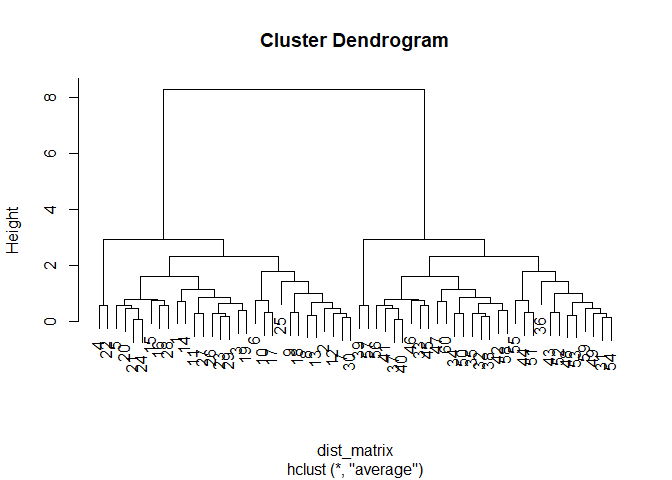
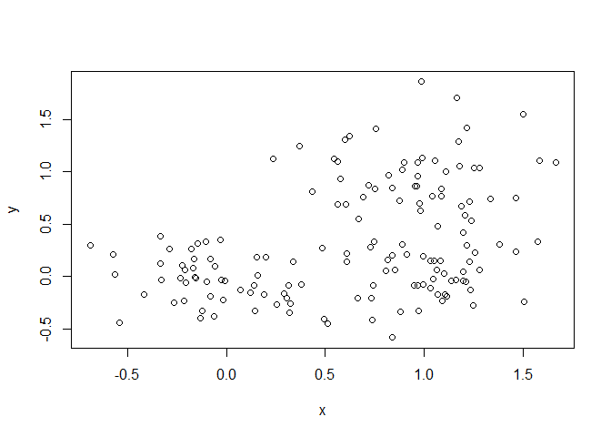
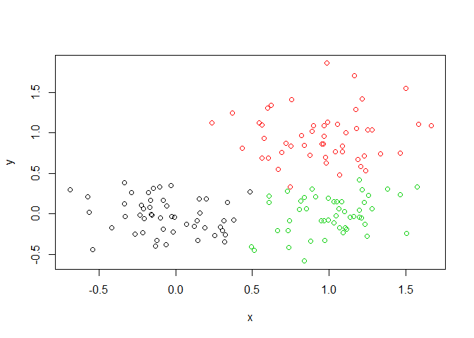
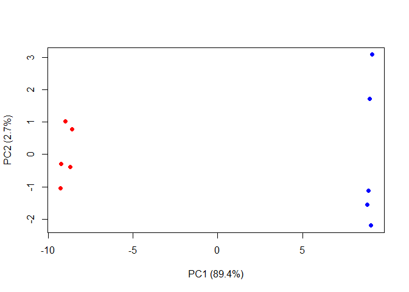

## K-Means Example

Making up data to try K-means:


```r
tmp <- c(rnorm(30, -3), rnorm(30, 3) )
x <- cbind(x=tmp, y=rev(tmp))

plot(x)
```

<!-- -->


Our tasks are:

1. Use kmeans() function setting k to 2 and nstart to 20.
2. Inspect/print the results

Questions:
  a. How many points are in each cluster?                       30 in each
  b. What "component" of your result object details:
    - Cluster size?                                             km$size
    - Cluster assignment/membership?                            km$cluster
    - Cluster center?                                           km$centers


```r
km <- kmeans(x, centers=2, nstart=20)

km
```

```
## K-means clustering with 2 clusters of sizes 30, 30
## 
## Cluster means:
##           x         y
## 1  2.535956 -3.349833
## 2 -3.349833  2.535956
## 
## Clustering vector:
##  [1] 2 2 2 2 2 2 2 2 2 2 2 2 2 2 2 2 2 2 2 2 2 2 2 2 2 2 2 2 2 2 1 1 1 1 1
## [36] 1 1 1 1 1 1 1 1 1 1 1 1 1 1 1 1 1 1 1 1 1 1 1 1 1
## 
## Within cluster sum of squares by cluster:
## [1] 52.5981 52.5981
##  (between_SS / total_SS =  90.8 %)
## 
## Available components:
## 
## [1] "cluster"      "centers"      "totss"        "withinss"    
## [5] "tot.withinss" "betweenss"    "size"         "iter"        
## [9] "ifault"
```


Checking the cluster component:


```r
km$cluster
```

```
##  [1] 2 2 2 2 2 2 2 2 2 2 2 2 2 2 2 2 2 2 2 2 2 2 2 2 2 2 2 2 2 2 1 1 1 1 1
## [36] 1 1 1 1 1 1 1 1 1 1 1 1 1 1 1 1 1 1 1 1 1 1 1 1 1
```


Checking the points in each cluster (size):


```r
km$size
```

```
## [1] 30 30
```


Checking cluster centers:


```r
km$centers
```

```
##           x         y
## 1  2.535956 -3.349833
## 2 -3.349833  2.535956
```


Plot x colored by the kmeans cluster assignment and add cluster centers as blue points


```r
plot(x, col=km$cluster)

points(km$centers, col="blue", pch=15)
```

<!-- -->


SS? Use tot.withinss


```r
km$tot.withinss
```

```
## [1] 105.1962
```


Repeat for k is 3; which one has the better total SS?


```r
km3 <- kmeans(x, centers=3, nstart=20)
km3
```

```
## K-means clustering with 3 clusters of sizes 19, 11, 30
## 
## Cluster means:
##           x         y
## 1 -3.298381  3.154755
## 2 -3.438705  1.467123
## 3  2.535956 -3.349833
## 
## Clustering vector:
##  [1] 1 1 1 1 1 2 2 2 1 1 1 2 1 2 1 1 2 1 1 2 1 1 2 1 2 2 1 1 1 2 3 3 3 3 3
## [36] 3 3 3 3 3 3 3 3 3 3 3 3 3 3 3 3 3 3 3 3 3 3 3 3 3
## 
## Within cluster sum of squares by cluster:
## [1] 20.24546 12.37370 52.59810
##  (between_SS / total_SS =  92.6 %)
## 
## Available components:
## 
## [1] "cluster"      "centers"      "totss"        "withinss"    
## [5] "tot.withinss" "betweenss"    "size"         "iter"        
## [9] "ifault"
```


The "tot.withinss" is the value we are looking for here to evaluate best SS


```r
km3$tot.withinss
```

```
## [1] 85.21726
```


## Hierarchical Clustering

First we need to calculate the point (dis)similarity as the Euclidian distance between observations


```r
dist_matrix <- dist(x)
dist_matrix
```

```
##             1          2          3          4          5          6
## 2   1.1702206                                                       
## 3   1.7666881  0.8136155                                            
## 4   2.1104175  1.2210421  0.4078137                                 
## 5   1.4966710  0.4216850  0.4041858  0.8104687                      
## 6   1.5592859  0.6694574  1.2991680  1.6824575  0.9169031           
## 7   1.8425065  0.8311294  1.2761319  1.6220136  0.9456103  0.3082072
## 8   3.1414999  1.9716295  1.6719084  1.6787443  1.7131935  1.7963469
## 9   1.6716870  0.9692342  0.3804934  0.4780240  0.6524547  1.5636667
## 10  3.1003234  2.3628798  1.5564312  1.1519804  1.9605924  2.8262296
## 11  1.7699982  1.0702487  0.4213094  0.4174488  0.7375217  1.6531125
## 12  2.3750663  1.2259753  1.2219715  1.4269532  1.0835233  0.9664012
## 13  1.4645340  0.7748082  0.4044158  0.6527171  0.5202219  1.3997451
## 14  1.6166933  0.6182939  1.1678874  1.5422288  0.8002295  0.1596420
## 15  2.7849897  2.1443489  1.3693067  0.9934652  1.7664055  2.6671690
## 16  3.4954513  2.5452174  1.7587803  1.3857653  2.1240579  2.8420554
## 17  3.1047108  2.1248409  2.3541293  2.5778980  2.1400503  1.5509148
## 18  2.6106294  1.6162358  0.8473401  0.5329809  1.1958920  1.9350053
## 19  1.3389362  0.2367258  0.5791066  0.9869155  0.1857274  0.8001451
## 20  2.3915250  1.3301149  1.5481724  1.8073490  1.3194722  0.8501081
## 21  0.6787255  0.6698665  1.4484604  1.8463061  1.0822258  0.8878375
## 22  1.8659801  1.8744165  1.5370841  1.4895144  1.7258923  2.5423938
## 23  2.7735792  1.6894782  1.7938592  1.9926517  1.6253308  1.2354095
## 24  2.6523856  1.5283907  0.9632208  0.8703321  1.1558900  1.6510378
## 25  3.9043208  2.8464498  2.8920712  3.0193018  2.7701562  2.3464911
## 26  1.5473004  1.9590292  2.7718907  3.1782787  2.3783155  1.7351259
## 27  1.6322909  0.4620713  0.6683497  1.0380595  0.3441838  0.6464651
## 28  0.8961683  1.0755002  1.2074918  1.4355132  1.1399159  1.7195574
## 29  2.1916786  1.0546328  0.6105101  0.7257456  0.6984029  1.2169877
## 30  2.7758805  1.6318624  1.5684438  1.7097446  1.4765635  1.3180213
## 31  7.6468585  7.8586890  8.6265941  9.0205520  8.2268345  7.3405736
## 32  7.8399956  8.1895056  8.9824033  9.3850843  8.5785483  7.7253471
## 33  7.2482379  7.8342762  8.6477607  9.0553177  8.2489310  7.4896468
## 34  7.2279490  7.6107999  8.4094026  8.8139573  8.0052263  7.1653611
## 35  4.9973299  5.4882038  6.2997063  6.7074831  5.8980805  5.1188519
## 36  7.7461231  7.7590121  8.4736943  8.8473967  8.0882699  7.1749222
## 37  8.2713232  8.5897067  9.3768409  9.7775282  8.9736427  8.1099602
## 38  7.3369211  7.5206034  8.2832271  8.6753478  7.8846147  6.9940059
## 39  8.2025911  8.8192170  9.6328289 10.0400241  9.2353864  8.4850446
## 40  6.3517749  6.8465250  7.6569418  8.0645757  7.2545742  6.4618205
## 41  7.1043956  7.3391153  8.1134603  8.5098774  7.7123312  6.8330345
## 42  7.1885281  7.6236387  8.4283231  8.8346450  8.0244007  7.2025176
## 43  8.5336376  8.9132666  9.7095225 10.1132418  9.3054381  8.4583289
## 44  7.0598884  7.1632240  7.9072093  8.2925332  7.5132060  6.6105420
## 45  9.4570137  9.8163195 10.6083874 11.0106489 10.2046364  9.3482584
## 46  9.0471825  9.5313505 10.3390111 10.7460507  9.9355823  9.1225073
## 47  6.7841762  7.1354002  7.9305542  8.3340754  7.5265130  6.6794500
## 48  7.6367529  8.1233779  8.9322015  9.3395250  8.5291334  7.7239276
## 49  7.4595954  7.7271834  8.5069395  8.9051857  8.1048442  7.2315779
## 50  7.9626953  8.4440965  9.2522642  9.6594390  8.8489882  8.0399143
## 51  9.3052544  9.7562526 10.5605502 10.9666971 10.1565619  9.3301934
## 52  7.8560675  8.3382988  9.1466137  9.5538234  8.7433822  7.9352086
## 53  8.2037811  8.4107341  9.1759908  9.5688297  8.7768663  7.8878794
## 54  6.8351790  7.1499460  7.9394979  8.3411990  7.5359537  6.6780014
## 55  6.6245951  6.9786315  7.7745178  8.1782868  7.3704330  6.5252569
## 56  7.3694906  7.7966382  8.6002714  9.0062977  8.1962399  7.3704330
## 57  8.1740469  8.6070066  9.4103597  9.8162743  9.0062977  8.1782868
## 58  7.7668494  8.2004323  9.0042876  9.4103597  8.6002714  7.7745178
## 59  6.9532380  7.3948238  8.2004323  8.6070066  7.7966382  6.9786315
## 60  6.3528360  6.9532380  7.7668494  8.1740469  7.3694906  6.6245951
##             7          8          9         10         11         12
## 2                                                                   
## 3                                                                   
## 4                                                                   
## 5                                                                   
## 6                                                                   
## 7                                                                   
## 8   1.5022981                                                       
## 9   1.5932358  2.0307827                                            
## 10  2.7355732  2.2900437  1.4588169                                 
## 11  1.6701051  2.0293450  0.1066297  1.3531755                      
## 12  0.6746528  0.8299740  1.6004386  2.3943088  1.6406979           
## 13  1.4623104  2.0704242  0.2200804  1.6787213  0.3264301  1.5566511
## 14  0.2290178  1.6605756  1.4523111  2.6807200  1.5373246  0.8330783
## 15  2.6154026  2.3911509  1.1944458  0.3782893  1.0881377  2.3630770
## 16  2.6702838  1.7932530  1.8351643  0.8073381  1.7464179  2.1627092
## 17  1.3004565  1.3817777  2.7251677  3.4964166  2.7754322  1.1510197
## 18  1.7935410  1.3630043  1.0108670  1.0038759  0.9472960  1.3930261
## 19  0.8843948  1.8293187  0.7711865  2.1326622  0.8665761  1.1410347
## 20  0.5503289  1.1044696  1.9129576  2.8157685  1.9685559  0.4292744
## 21  1.1814073  2.5653961  1.5044768  2.9561175  1.6111033  1.7629538
## 22  2.6523416  3.1585338  1.1566842  1.7598502  1.1359893  2.7526268
## 23  0.9349616  0.8950074  2.1711440  2.9032392  2.2133381  0.5730684
## 24  1.4420504  0.8269769  1.2757028  1.5401289  1.2536221  0.9126625
## 25  2.0643627  1.4478431  3.2725079  3.7376389  3.3005153  1.6896937
## 26  2.0071517  3.5034341  2.8644893  4.3083999  2.9710173  2.6809949
## 27  0.6131160  1.5098017  0.9814819  2.1797644  1.0570128  0.7890647
## 28  1.9066284  2.8356802  0.9576370  2.2724978  1.0317851  2.2150627
## 29  1.0509396  1.0645156  0.9808874  1.7198451  0.9956160  0.7063469
## 30  1.0115043  0.5569546  1.9487485  2.5558205  1.9766123  0.4062228
## 31  7.4514123  8.5180948  8.8272321 10.1667953  8.9289178  7.9415515
## 32  7.8696355  9.0425267  9.1481424 10.5370470  9.2526039  8.4085561
## 33  7.6922986  9.0367000  8.7434677 10.1900006  8.8500931  8.3069399
## 34  7.3211193  8.5342664  8.5643582  9.9655949  8.6694067  7.8772680
## 35  5.3167070  6.6637665  6.4164459  7.8503198  6.5227896  5.9298863
## 36  7.2325666  8.1111658  8.7210552  9.9668525  8.8168174  7.6362001
## 37  8.2444221  9.3825053  9.5520366 10.9289198  9.6558907  8.7682922
## 38  7.0995000  8.1521879  8.4896790  9.8197304  8.5907562  7.5824435
## 39  8.6905019 10.0383802  9.7204179 11.1706712  9.8270358  9.3073395
## 40  6.6491778  7.9586125  7.7778181  9.2092367  7.8841093  7.2474239
## 41  6.9530723  8.0564610  8.3065422  9.6584660  8.4089019  7.4588038
## 42  7.3709319  8.6216150  8.5686924  9.9844112  8.6744026  7.9439598
## 43  8.6067342  9.7872973  9.8687699 11.2651646  9.9736366  9.1501143
## 44  6.6969285  7.6889984  8.1315701  9.4288737  8.2305576  7.1509802
## 45  9.4880303 10.6348881 10.7751652 12.1625461 10.8796196 10.0174783
## 46  9.2941711 10.5432659 10.4692673 11.8939077 10.5753676  9.8685874
## 47  6.8304095  8.0333615  8.0925630  9.4860245  8.1972003  7.3811329
## 48  7.9020446  9.1775705  9.0589111 10.4862221  9.1650850  8.4867382
## 49  7.3576542  8.4763749  8.6929812 10.0551707  8.7959675  7.8712284
## 50  8.2152775  9.4809796  9.3812398 10.8068062  9.4873570  8.7959675
## 51  9.4929850 10.7138313 10.7010462 12.1167545 10.8068062 10.0551707
## 52  8.1112556  9.3795520  9.2751110 10.7010462  9.3812398  8.6929812
## 53  7.9944467  9.0405298  9.3795520 10.7138313  9.4809796  8.4763749
## 54  6.8197638  7.9944467  8.1112556  9.4929850  8.2152775  7.3576542
## 55  6.6780014  7.8878794  7.9352086  9.3301934  8.0399143  7.2315779
## 56  7.5359537  8.7768663  8.7433822 10.1565619  8.8489882  8.1048442
## 57  8.3411990  9.5688297  9.5538234 10.9666971  9.6594390  8.9051857
## 58  7.9394979  9.1759908  9.1466137 10.5605502  9.2522642  8.5069395
## 59  7.1499460  8.4107341  8.3382988  9.7562526  8.4440965  7.7271834
## 60  6.8351790  8.2037811  7.8560675  9.3052544  7.9626953  7.4595954
##            13         14         15         16         17         18
## 2                                                                   
## 3                                                                   
## 4                                                                   
## 5                                                                   
## 6                                                                   
## 7                                                                   
## 8                                                                   
## 9                                                                   
## 10                                                                  
## 11                                                                  
## 12                                                                  
## 13                                                                  
## 14  1.3013405                                                       
## 15  1.4120777  2.5313375                                            
## 16  2.0326430  2.6837623  1.1368150                                 
## 17  2.6502929  1.5269739  3.4991350  3.1336705                      
## 18  1.1747581  1.7793378  1.0343209  0.9301515  2.4950727           
## 19  0.5996049  0.7062319  1.9246384  2.3097699  2.1357149  1.3815705
## 20  1.8307911  0.7748724  2.7681723  2.5887663  0.8205782  1.8176772
## 21  1.2855911  0.9619623  2.6974680  3.2019150  2.4271172  2.2766332
## 22  1.2098235  2.4700084  1.3815985  2.4664777  3.8598594  1.9420992
## 23  2.1174180  1.1573553  2.9045340  2.5692654  0.5950588  1.9009265
## 24  1.3645636  1.4916424  1.5880608  1.2525358  1.9601189  0.5542683
## 25  3.2443355  2.2926460  3.8244650  3.2070770  0.8623305  2.7902985
## 26  2.6465071  1.8891529  4.0585649  4.4895089  2.8104909  3.5599212
## 27  0.8639771  0.5042782  2.0273425  2.2293102  1.8007321  1.3073832
## 28  0.8111094  1.6911620  1.9334716  2.7699352  3.1966428  1.9679402
## 29  1.0060011  1.0579858  1.6613136  1.6270236  1.8551239  0.7454927
## 30  1.9282307  1.2021301  2.5795804  2.1968213  0.9467386  1.5595402
## 31  8.6245858  7.4869449  9.9931144 10.0975699  7.1742139  9.2447978
## 32  8.9375683  7.8782915 10.3338014 10.5383727  7.7385348  9.6554800
## 33  8.5244563  7.6489964  9.9356885 10.3273209  7.8582909  9.4066485
## 34  8.3519708  7.3200714  9.7536329  9.9913866  7.2546675  9.0992853
## 35  6.1993548  5.2778796  7.6108917  7.9596375  5.5127942  7.0428650
## 36  8.5337837  7.3075709  9.8387135  9.7939275  6.7327265  8.9994428
## 37  9.3432600  8.2612075 10.7336167 10.9089380  8.0613187 10.0347128
## 38  8.2887031  7.1391256  9.6509976  9.7403872  6.8054195  8.8923041
## 39  9.5009429  8.6445130 10.9106439 11.3204061  8.8573668 10.3980567
## 40  7.5609463  6.6201741  8.9722446  9.3038707  6.7543595  8.3913740
## 41  8.1020783  6.9813114  9.4776654  9.6086711  6.7270874  8.7463651
## 42  8.3540809  7.3589516  9.7613693 10.0385926  7.3655268  9.1374262
## 43  9.6569241  8.6120040 11.0568978 11.2763379  8.4840008 10.3902548
## 44  7.9361467  6.7509620  9.2764960  9.3133702  6.3283224  8.4840008
## 45 10.5645671  9.5005473 11.9606465 12.1547178  9.3133702 11.2763379
## 46 10.2531683  9.2794277 11.6633490 11.9606465  9.2764960 11.0568978
## 47  7.8814881  6.8333811  9.2794277  9.5005473  6.7509620  8.6120040
## 48  8.8425286  7.8814881 10.2531683 10.5645671  7.9361467  9.6569241
## 49  8.4867382  7.3811329  9.8685874 10.0174783  7.1509802  9.1501143
## 50  9.1650850  8.1972003 10.5753676 10.8796196  8.2305576  9.9736366
## 51 10.4862221  9.4860245 11.8939077 12.1625461  9.4288737 11.2651646
## 52  9.0589111  8.0925630 10.4692673 10.7751652  8.1315701  9.8687699
## 53  9.1775705  8.0333615 10.5432659 10.6348881  7.6889984  9.7872973
## 54  7.9020446  6.8304095  9.2941711  9.4880303  6.6969285  8.6067342
## 55  7.7239276  6.6794500  9.1225073  9.3482584  6.6105420  8.4583289
## 56  8.5291334  7.5265130  9.9355823 10.2046364  7.5132060  9.3054381
## 57  9.3395250  8.3340754 10.7460507 11.0106489  8.2925332 10.1132418
## 58  8.9322015  7.9305542 10.3390111 10.6083874  7.9072093  9.7095225
## 59  8.1233779  7.1354002  9.5313505  9.8163195  7.1632240  8.9132666
## 60  7.6367529  6.7841762  9.0471825  9.4570137  7.0598884  8.5336376
##            19         20         21         22         23         24
## 2                                                                   
## 3                                                                   
## 4                                                                   
## 5                                                                   
## 6                                                                   
## 7                                                                   
## 8                                                                   
## 9                                                                   
## 10                                                                  
## 11                                                                  
## 12                                                                  
## 13                                                                  
## 14                                                                  
## 15                                                                  
## 16                                                                  
## 17                                                                  
## 18                                                                  
## 19                                                                  
## 20  1.3201548                                                       
## 21  0.8975509  1.7316135                                            
## 22  1.7685407  3.0406023  2.1114823                                 
## 23  1.6530485  0.3853760  2.1163531  3.3200481                      
## 24  1.3219374  1.3410510  2.1930293  2.3598018  1.3705891           
## 25  2.8085662  1.5225490  3.2340669  4.4291549  1.1579994  2.2379398
## 26  2.1953199  2.4405608  1.3621174  3.3775681  2.7832536  3.3647693
## 27  0.3534482  0.9808049  1.0942900  2.0698298  1.3023965  1.1117502
## 28  1.0797636  2.3907893  1.1300265  1.0017134  2.7321839  2.1706424
## 29  0.8544262  1.1073255  1.7180390  2.1311293  1.2673948  0.4750686
## 30  1.5443160  0.5530613  2.1523348  3.1054301  0.3740184  1.0162366
## 31  8.0705710  7.5234890  7.4030414  9.4816436  7.6274954  8.8456282
## 32  8.4120768  8.0036248  7.6777630  9.7013265  8.1475211  9.2951995
## 33  8.0689337  7.9424713  7.2389919  9.0987176  8.1612927  9.1318986
## 34  7.8360222  7.4792611  7.0847632  9.0917966  7.6403248  8.7543405
## 35  5.7207296  5.5672328  4.9162243  6.8631010  5.7930039  6.7573226
## 36  7.9503927  7.2076694  7.3954071  9.5065258  7.2463020  8.5486877
## 37  8.8097278  8.3583192  8.0912237 10.1291868  8.4880750  9.6617695
## 38  7.7303067  7.1630983  7.0763391  9.1629294  7.2625312  8.4880750
## 39  9.0544904  8.9438772  8.2164115 10.0428561  9.1629294 10.1291868
## 40  7.0782587  6.8720995  6.2782001  8.2164115  7.0763391  8.0912237
## 41  7.5535764  7.0445773  6.8720995  8.9438772  7.1630983  8.3583192
## 42  7.8519556  7.5535764  7.0782587  9.0544904  7.7303067  8.8097278
## 43  9.1374262  8.7463651  8.3913740 10.3980567  8.8923041 10.0347128
## 44  7.3655268  6.7270874  6.7543595  8.8573668  6.8054195  8.0613187
## 45 10.0385926  9.6086711  9.3038707 11.3204061  9.7403872 10.9089380
## 46  9.7613693  9.4776654  8.9722446 10.9106439  9.6509976 10.7336167
## 47  7.3589516  6.9813114  6.6201741  8.6445130  7.1391256  8.2612075
## 48  8.3540809  8.1020783  7.5609463  9.5009429  8.2887031  9.3432600
## 49  7.9439598  7.4588038  7.2474239  9.3073395  7.5824435  8.7682922
## 50  8.6744026  8.4089019  7.8841093  9.8270358  8.5907562  9.6558907
## 51  9.9844112  9.6584660  9.2092367 11.1706712  9.8197304 10.9289198
## 52  8.5686924  8.3065422  7.7778181  9.7204179  8.4896790  9.5520366
## 53  8.6216150  8.0564610  7.9586125 10.0383802  8.1521879  9.3825053
## 54  7.3709319  6.9530723  6.6491778  8.6905019  7.0995000  8.2444221
## 55  7.2025176  6.8330345  6.4618205  8.4850446  6.9940059  8.1099602
## 56  8.0244007  7.7123312  7.2545742  9.2353864  7.8846147  8.9736427
## 57  8.8346450  8.5098774  8.0645757 10.0400241  8.6753478  9.7775282
## 58  8.4283231  8.1134603  7.6569418  9.6328289  8.2832271  9.3768409
## 59  7.6236387  7.3391153  6.8465250  8.8192170  7.5206034  8.5897067
## 60  7.1885281  7.1043956  6.3517749  8.2025911  7.3369211  8.2713232
##            25         26         27         28         29         30
## 2                                                                   
## 3                                                                   
## 4                                                                   
## 5                                                                   
## 6                                                                   
## 7                                                                   
## 8                                                                   
## 9                                                                   
## 10                                                                  
## 11                                                                  
## 12                                                                  
## 13                                                                  
## 14                                                                  
## 15                                                                  
## 16                                                                  
## 17                                                                  
## 18                                                                  
## 19                                                                  
## 20                                                                  
## 21                                                                  
## 22                                                                  
## 23                                                                  
## 24                                                                  
## 25                                                                  
## 26  3.6703075                                                       
## 27  2.4562997  2.2712391                                            
## 28  3.8883003  2.3770986  1.4326001                                 
## 29  2.3106070  2.9055535  0.6401599  1.7799696                      
## 30  1.3241077  2.9816263  1.1937771  2.6137253  0.9907082           
## 31  7.6195399  6.1068418  7.9870367  8.4799789  8.5005563  7.9915384
## 32  8.2570387  6.3358242  8.3676134  8.7063735  8.9191782  8.5005563
## 33  8.5142885  5.8816535  8.0997124  8.1434237  8.7063735  8.4799789
## 34  7.8113844  5.7355167  7.8042111  8.0997124  8.3676134  7.9870367
## 35  6.2058091  3.5541870  5.7355167  5.8816535  6.3358242  6.1068418
## 36  7.0454678  6.2058091  7.8113844  8.5142885  8.2570387  7.6195399
## 37  8.5486877  6.7573226  8.7543405  9.1318986  9.2951995  8.8456282
## 38  7.2463020  5.7930039  7.6403248  8.1612927  8.1475211  7.6274954
## 39  9.5065258  6.8631010  9.0917966  9.0987176  9.7013265  9.4816436
## 40  7.3954071  4.9162243  7.0847632  7.2389919  7.6777630  7.4030414
## 41  7.2076694  5.5672328  7.4792611  7.9424713  8.0036248  7.5234890
## 42  7.9503927  5.7207296  7.8360222  8.0689337  8.4120768  8.0705710
## 43  8.9994428  7.0428650  9.0992853  9.4066485  9.6554800  9.2447978
## 44  6.7327265  5.5127942  7.2546675  7.8582909  7.7385348  7.1742139
## 45  9.7939275  7.9596375  9.9913866 10.3273209 10.5383727 10.0975699
## 46  9.8387135  7.6108917  9.7536329  9.9356885 10.3338014  9.9931144
## 47  7.3075709  5.2778796  7.3200714  7.6489964  7.8782915  7.4869449
## 48  8.5337837  6.1993548  8.3519708  8.5244563  8.9375683  8.6245858
## 49  7.6362001  5.9298863  7.8772680  8.3069399  8.4085561  7.9415515
## 50  8.8168174  6.5227896  8.6694067  8.8500931  9.2526039  8.9289178
## 51  9.9668525  7.8503198  9.9655949 10.1900006 10.5370470 10.1667953
## 52  8.7210552  6.4164459  8.5643582  8.7434677  9.1481424  8.8272321
## 53  8.1111658  6.6637665  8.5342664  9.0367000  9.0425267  8.5180948
## 54  7.2325666  5.3167070  7.3211193  7.6922986  7.8696355  7.4514123
## 55  7.1749222  5.1188519  7.1653611  7.4896468  7.7253471  7.3405736
## 56  8.0882699  5.8980805  8.0052263  8.2489310  8.5785483  8.2268345
## 57  8.8473967  6.7074831  8.8139573  9.0553177  9.3850843  9.0205520
## 58  8.4736943  6.2997063  8.4094026  8.6477607  8.9824033  8.6265941
## 59  7.7590121  5.4882038  7.6107999  7.8342762  8.1895056  7.8586890
## 60  7.7461231  4.9973299  7.2279490  7.2482379  7.8399956  7.6468585
##            31         32         33         34         35         36
## 2                                                                   
## 3                                                                   
## 4                                                                   
## 5                                                                   
## 6                                                                   
## 7                                                                   
## 8                                                                   
## 9                                                                   
## 10                                                                  
## 11                                                                  
## 12                                                                  
## 13                                                                  
## 14                                                                  
## 15                                                                  
## 16                                                                  
## 17                                                                  
## 18                                                                  
## 19                                                                  
## 20                                                                  
## 21                                                                  
## 22                                                                  
## 23                                                                  
## 24                                                                  
## 25                                                                  
## 26                                                                  
## 27                                                                  
## 28                                                                  
## 29                                                                  
## 30                                                                  
## 31                                                                  
## 32  0.9907082                                                       
## 33  2.6137253  1.7799696                                            
## 34  1.1937771  0.6401599  1.4326001                                 
## 35  2.9816263  2.9055535  2.3770986  2.2712391                      
## 36  1.3241077  2.3106070  3.8883003  2.4562997  3.6703075           
## 37  1.0162366  0.4750686  2.1706424  1.1117502  3.3647693  2.2379398
## 38  0.3740184  1.2673948  2.7321839  1.3023965  2.7832536  1.1579994
## 39  3.1054301  2.1311293  1.0017134  2.0698298  3.3775681  4.4291549
## 40  2.1523348  1.7180390  1.1300265  1.0942900  1.3621174  3.2340669
## 41  0.5530613  1.1073255  2.3907893  0.9808049  2.4405608  1.5225490
## 42  1.5443160  0.8544262  1.0797636  0.3534482  2.1953199  2.8085662
## 43  1.5595402  0.7454927  1.9679402  1.3073832  3.5599212  2.7902985
## 44  0.9467386  1.8551239  3.1966428  1.8007321  2.8104909  0.8623305
## 45  2.1968213  1.6270236  2.7699352  2.2293102  4.4895089  3.2070770
## 46  2.5795804  1.6613136  1.9334716  2.0273425  4.0585649  3.8244650
## 47  1.2021301  1.0579858  1.6911620  0.5042782  1.8891529  2.2926460
## 48  1.9282307  1.0060011  0.8111094  0.8639771  2.6465071  3.2443355
## 49  0.4062228  0.7063469  2.2150627  0.7890647  2.6809949  1.6896937
## 50  1.9766123  0.9956160  1.0317851  1.0570128  2.9710173  3.3005153
## 51  2.5558205  1.7198451  2.2724978  2.1797644  4.3083999  3.7376389
## 52  1.9487485  0.9808874  0.9576370  0.9814819  2.8644893  3.2725079
## 53  0.5569546  1.0645156  2.8356802  1.5098017  3.5034341  1.4478431
## 54  1.0115043  1.0509396  1.9066284  0.6131160  2.0071517  2.0643627
## 55  1.3180213  1.2169877  1.7195574  0.6464651  1.7351259  2.3464911
## 56  1.4765635  0.6984029  1.1399159  0.3441838  2.3783155  2.7701562
## 57  1.7097446  0.7257456  1.4355132  1.0380595  3.1782787  3.0193018
## 58  1.5684438  0.6105101  1.2074918  0.6683497  2.7718907  2.8920712
## 59  1.6318624  1.0546328  1.0755002  0.4620713  1.9590292  2.8464498
## 60  2.7758805  2.1916786  0.8961683  1.6322909  1.5473004  3.9043208
##            37         38         39         40         41         42
## 2                                                                   
## 3                                                                   
## 4                                                                   
## 5                                                                   
## 6                                                                   
## 7                                                                   
## 8                                                                   
## 9                                                                   
## 10                                                                  
## 11                                                                  
## 12                                                                  
## 13                                                                  
## 14                                                                  
## 15                                                                  
## 16                                                                  
## 17                                                                  
## 18                                                                  
## 19                                                                  
## 20                                                                  
## 21                                                                  
## 22                                                                  
## 23                                                                  
## 24                                                                  
## 25                                                                  
## 26                                                                  
## 27                                                                  
## 28                                                                  
## 29                                                                  
## 30                                                                  
## 31                                                                  
## 32                                                                  
## 33                                                                  
## 34                                                                  
## 35                                                                  
## 36                                                                  
## 37                                                                  
## 38  1.3705891                                                       
## 39  2.3598018  3.3200481                                            
## 40  2.1930293  2.1163531  2.1114823                                 
## 41  1.3410510  0.3853760  3.0406023  1.7316135                      
## 42  1.3219374  1.6530485  1.7685407  0.8975509  1.3201548           
## 43  0.5542683  1.9009265  1.9420992  2.2766332  1.8176772  1.3815705
## 44  1.9601189  0.5950588  3.8598594  2.4271172  0.8205782  2.1357149
## 45  1.2525358  2.5692654  2.4664777  3.2019150  2.5887663  2.3097699
## 46  1.5880608  2.9045340  1.3815985  2.6974680  2.7681723  1.9246384
## 47  1.4916424  1.1573553  2.4700084  0.9619623  0.7748724  0.7062319
## 48  1.3645636  2.1174180  1.2098235  1.2855911  1.8307911  0.5996049
## 49  0.9126625  0.5730684  2.7526268  1.7629538  0.4292744  1.1410347
## 50  1.2536221  2.2133381  1.1359893  1.6111033  1.9685559  0.8665761
## 51  1.5401289  2.9032392  1.7598502  2.9561175  2.8157685  2.1326622
## 52  1.2757028  2.1711440  1.1566842  1.5044768  1.9129576  0.7711865
## 53  0.8269769  0.8950074  3.1585338  2.5653961  1.1044696  1.8293187
## 54  1.4420504  0.9349616  2.6523416  1.1814073  0.5503289  0.8843948
## 55  1.6510378  1.2354095  2.5423938  0.8878375  0.8501081  0.8001451
## 56  1.1558900  1.6253308  1.7258923  1.0822258  1.3194722  0.1857274
## 57  0.8703321  1.9926517  1.4895144  1.8463061  1.8073490  0.9869155
## 58  0.9632208  1.7938592  1.5370841  1.4484604  1.5481724  0.5791066
## 59  1.5283907  1.6894782  1.8744165  0.6698665  1.3301149  0.2367258
## 60  2.6523856  2.7735792  1.8659801  0.6787255  2.3915250  1.3389362
##            43         44         45         46         47         48
## 2                                                                   
## 3                                                                   
## 4                                                                   
## 5                                                                   
## 6                                                                   
## 7                                                                   
## 8                                                                   
## 9                                                                   
## 10                                                                  
## 11                                                                  
## 12                                                                  
## 13                                                                  
## 14                                                                  
## 15                                                                  
## 16                                                                  
## 17                                                                  
## 18                                                                  
## 19                                                                  
## 20                                                                  
## 21                                                                  
## 22                                                                  
## 23                                                                  
## 24                                                                  
## 25                                                                  
## 26                                                                  
## 27                                                                  
## 28                                                                  
## 29                                                                  
## 30                                                                  
## 31                                                                  
## 32                                                                  
## 33                                                                  
## 34                                                                  
## 35                                                                  
## 36                                                                  
## 37                                                                  
## 38                                                                  
## 39                                                                  
## 40                                                                  
## 41                                                                  
## 42                                                                  
## 43                                                                  
## 44  2.4950727                                                       
## 45  0.9301515  3.1336705                                            
## 46  1.0343209  3.4991350  1.1368150                                 
## 47  1.7793378  1.5269739  2.6837623  2.5313375                      
## 48  1.1747581  2.6502929  2.0326430  1.4120777  1.3013405           
## 49  1.3930261  1.1510197  2.1627092  2.3630770  0.8330783  1.5566511
## 50  0.9472960  2.7754322  1.7464179  1.0881377  1.5373246  0.3264301
## 51  1.0038759  3.4964166  0.8073381  0.3782893  2.6807200  1.6787213
## 52  1.0108670  2.7251677  1.8351643  1.1944458  1.4523111  0.2200804
## 53  1.3630043  1.3817777  1.7932530  2.3911509  1.6605756  2.0704242
## 54  1.7935410  1.3004565  2.6702838  2.6154026  0.2290178  1.4623104
## 55  1.9350053  1.5509148  2.8420554  2.6671690  0.1596420  1.3997451
## 56  1.1958920  2.1400503  2.1240579  1.7664055  0.8002295  0.5202219
## 57  0.5329809  2.5778980  1.3857653  0.9934652  1.5422288  0.6527171
## 58  0.8473401  2.3541293  1.7587803  1.3693067  1.1678874  0.4044158
## 59  1.6162358  2.1248409  2.5452174  2.1443489  0.6182939  0.7748082
## 60  2.6106294  3.1047108  3.4954513  2.7849897  1.6166933  1.4645340
##            49         50         51         52         53         54
## 2                                                                   
## 3                                                                   
## 4                                                                   
## 5                                                                   
## 6                                                                   
## 7                                                                   
## 8                                                                   
## 9                                                                   
## 10                                                                  
## 11                                                                  
## 12                                                                  
## 13                                                                  
## 14                                                                  
## 15                                                                  
## 16                                                                  
## 17                                                                  
## 18                                                                  
## 19                                                                  
## 20                                                                  
## 21                                                                  
## 22                                                                  
## 23                                                                  
## 24                                                                  
## 25                                                                  
## 26                                                                  
## 27                                                                  
## 28                                                                  
## 29                                                                  
## 30                                                                  
## 31                                                                  
## 32                                                                  
## 33                                                                  
## 34                                                                  
## 35                                                                  
## 36                                                                  
## 37                                                                  
## 38                                                                  
## 39                                                                  
## 40                                                                  
## 41                                                                  
## 42                                                                  
## 43                                                                  
## 44                                                                  
## 45                                                                  
## 46                                                                  
## 47                                                                  
## 48                                                                  
## 49                                                                  
## 50  1.6406979                                                       
## 51  2.3943088  1.3531755                                            
## 52  1.6004386  0.1066297  1.4588169                                 
## 53  0.8299740  2.0293450  2.2900437  2.0307827                      
## 54  0.6746528  1.6701051  2.7355732  1.5932358  1.5022981           
## 55  0.9664012  1.6531125  2.8262296  1.5636667  1.7963469  0.3082072
## 56  1.0835233  0.7375217  1.9605924  0.6524547  1.7131935  0.9456103
## 57  1.4269532  0.4174488  1.1519804  0.4780240  1.6787443  1.6220136
## 58  1.2219715  0.4213094  1.5564312  0.3804934  1.6719084  1.2761319
## 59  1.2259753  1.0702487  2.3628798  0.9692342  1.9716295  0.8311294
## 60  2.3750663  1.7699982  3.1003234  1.6716870  3.1414999  1.8425065
##            55         56         57         58         59
## 2                                                        
## 3                                                        
## 4                                                        
## 5                                                        
## 6                                                        
## 7                                                        
## 8                                                        
## 9                                                        
## 10                                                       
## 11                                                       
## 12                                                       
## 13                                                       
## 14                                                       
## 15                                                       
## 16                                                       
## 17                                                       
## 18                                                       
## 19                                                       
## 20                                                       
## 21                                                       
## 22                                                       
## 23                                                       
## 24                                                       
## 25                                                       
## 26                                                       
## 27                                                       
## 28                                                       
## 29                                                       
## 30                                                       
## 31                                                       
## 32                                                       
## 33                                                       
## 34                                                       
## 35                                                       
## 36                                                       
## 37                                                       
## 38                                                       
## 39                                                       
## 40                                                       
## 41                                                       
## 42                                                       
## 43                                                       
## 44                                                       
## 45                                                       
## 46                                                       
## 47                                                       
## 48                                                       
## 49                                                       
## 50                                                       
## 51                                                       
## 52                                                       
## 53                                                       
## 54                                                       
## 55                                                       
## 56  0.9169031                                            
## 57  1.6824575  0.8104687                                 
## 58  1.2991680  0.4041858  0.4078137                      
## 59  0.6694574  0.4216850  1.2210421  0.8136155           
## 60  1.5592859  1.4966710  2.1104175  1.7666881  1.1702206
```


Lets look at the class of this distance matrix


```r
class(dist_matrix)
```

```
## [1] "dist"
```

```r
# Can't view it normally, so we need to force it into a matrix: as.matrix()
View(as.matrix(dist_matrix))
dim(as.matrix(dist_matrix))
```

```
## [1] 60 60
```


Then use the hclust() function to return a hierarchical clustering model


```r
hc <- hclust(d=dist_matrix)

hc
```

```
## 
## Call:
## hclust(d = dist_matrix)
## 
## Cluster method   : complete 
## Distance         : euclidean 
## Number of objects: 60
```


Lets try to plot hc:


```r
plot(hc)
```

<!-- -->


To determine the number of clusters, look at the groupings we have and set an ab-line where we want to define the number of clusters.

ex. At Height 6 above, we would have **2** clusters. At Height 4, we would have **4** clusters.


```r
plot(hc)
abline(h=4, col="red")
```

<!-- -->

```r
# This cuts the tree at the height we specify and returns a vector
cutree(hc, h=4)
```

```
##  [1] 1 2 2 2 2 2 2 1 2 2 2 1 2 2 2 2 1 2 2 1 1 2 1 2 1 1 2 2 2 1 3 4 4 4 3
## [36] 3 4 3 4 3 3 4 4 3 4 4 4 4 3 4 4 4 3 4 4 4 4 4 4 3
```

```r
# Print out a graph with the four clusters clearly shown
plot(x, col=cutree(hc, h=4), pch=16 )
```

<!-- -->


Different hclust methods:


```r
hc.complete <- hclust(d=dist_matrix, method="complete")

hc.average <- hclust(d=dist_matrix, method="average")

hc.single <- hclust(d=dist_matrix, method="single")

hc.complete
```

```
## 
## Call:
## hclust(d = dist_matrix, method = "complete")
## 
## Cluster method   : complete 
## Distance         : euclidean 
## Number of objects: 60
```

```r
hc.average
```

```
## 
## Call:
## hclust(d = dist_matrix, method = "average")
## 
## Cluster method   : average 
## Distance         : euclidean 
## Number of objects: 60
```

```r
hc.single
```

```
## 
## Call:
## hclust(d = dist_matrix, method = "single")
## 
## Cluster method   : single 
## Distance         : euclidean 
## Number of objects: 60
```

```r
plot(hc.complete)
```

<!-- -->

```r
plot(hc.average)
```

<!-- -->

```r
plot(hc.single)
```

<!-- -->


## Hands-On Application

Generate sample data


```r
x <- rbind(
 matrix(rnorm(100, mean=0, sd = 0.3), ncol = 2), # c1
 matrix(rnorm(100, mean = 1, sd = 0.3), ncol = 2), # c2
 matrix(c(rnorm(50, mean = 1, sd = 0.3), # c3
 rnorm(50, mean = 0, sd = 0.3)), ncol = 2))
colnames(x) <- c("x", "y")
```


Plot the data wiithout clustering


```r
plot(x)
```

<!-- -->


Generate colors for known clusters


```r
col <- as.factor( rep(c("c1", "c2", "c3"), each=50) )
```


Plot using our generated color vector


```r
plot(x, col=col)
```

<!-- -->


Now find distance, hclust, plot, and cutree:


```r
temp_matrix <- dist(x)
hc2 <- hclust(d=temp_matrix)
plot(hc2)
```

<!-- -->

```r
clusters2 <- cutree(hc2, k=2)
plot(x, col=clusters2, pch=16)
```

<!-- -->


Now plot and check our results:


```r
clusters3 <- cutree(hc2, k=3)
plot(x, col=clusters3, pch=16)
```

<!-- -->


## PCA Applications


Generate sample data:


```r
mydata <- matrix(nrow=100, ncol=10)

rownames(mydata) <- paste("gene", 1:100, sep="")

colnames(mydata) <- c( paste("wt", 1:5, sep=""),
                       paste("ko", 6:10, sep="") )
```


Fill in some fake read counts:


```r
for (i in 1:nrow(mydata) )
{
  wt.values <- rpois(5, lambda = sample(x=10:1000, size = 1) )
  ko.values <- rpois(5, lambda = sample(x=10:1000, size = 1) )
  
  mydata[i,] <- c(wt.values, ko.values)
}

head(mydata)
```

```
##       wt1  wt2 wt3 wt4 wt5  ko6  ko7  ko8  ko9 ko10
## gene1 602  591 596 584 566 1070 1049 1008 1001  966
## gene2 134  130 130 120 125  579  663  576  578  560
## gene3 267  302 273 288 288  557  585  595  533  547
## gene4 959  941 973 991 926   70   58   50   55   67
## gene5 358  369 347 320 339  836  912  914  909  917
## gene6 992 1037 935 900 917  422  394  442  415  476
```


Now we can do the PCA! **Note:** prcomp() expects samples to be rows instead of columns, so we have to take the transpose of our data


```r
pca <- prcomp(t(mydata), scale=TRUE)
```


Check what is returned by prcomp():


```r
attributes(pca)
```

```
## $names
## [1] "sdev"     "rotation" "center"   "scale"    "x"       
## 
## $class
## [1] "prcomp"
```


The "x" portion of pca (accessed by pca$x) is what we use to plot. This generates our PC1 v. PC2 plot:


```r
plot(pca$x[,1], pca$x[,2])
```

<!-- -->


Use the square of the std. dev to calculate the variation: (psa$sdev)^2


```r
pca.var <- pca$sdev^2

# Roound the percentage
pca.var.per <- round(pca.var/sum(pca.var) * 100, 1)
```


Make a Scree Plot of the data:


```r
barplot(pca.var.per, main="Scree Plot", xlab="Principal Component", ylab="Percent Variation")
```

<!-- -->


Clearly, the Scree Plot shows that the difference between our data is significant! Now lets go back to the first graph and add color to help visualize the difference:


```r
colvec <- colnames(mydata)
colvec[grep("wt", colvec)] <- "red"
colvec[grep("ko", colvec)] <- "blue"

plot(pca$x[,1], pca$x[,2], col=colvec, pch=16, xlab=paste0("PC1 (", pca.var.per[1], "%)"),
     ylab=paste0("PC2 (", pca.var.per[2], "%)"))

# Add functionality to click to identify points:
identify(pca$x[,1], pca$x[,2], labels=colnames(mydata))
```

<!-- -->

```
## integer(0)
```


