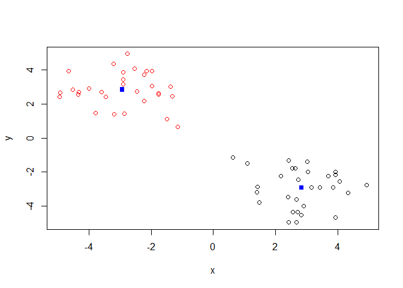
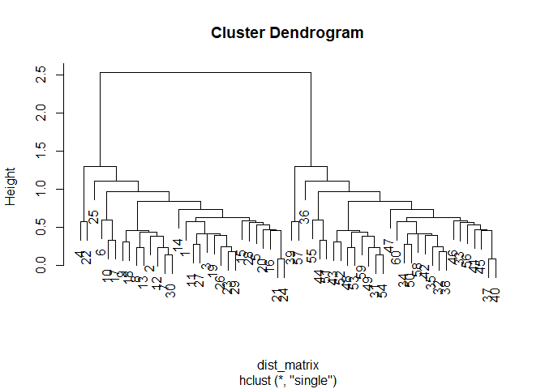

## K-Means Example

Making up data to try K-means:


```r
tmp <- c(rnorm(30, -3), rnorm(30, 3) )
x <- cbind(x=tmp, y=rev(tmp))

plot(x)
```

<!-- -->


Our tasks are:

1. Use kmeans() function setting k to 2 and nstart to 20.
2. Inspect/print the results

Questions:
  a. How many points are in each cluster?                       30 in each
  b. What "component" of your result object details:
    - Cluster size?                                             km$size
    - Cluster assignment/membership?                            km$cluster
    - Cluster center?                                           km$centers


```r
km <- kmeans(x, centers=2, nstart=20)

km
```

```
## K-means clustering with 2 clusters of sizes 30, 30
## 
## Cluster means:
##           x         y
## 1  2.835838 -2.922667
## 2 -2.922667  2.835838
## 
## Clustering vector:
##  [1] 2 2 2 2 2 2 2 2 2 2 2 2 2 2 2 2 2 2 2 2 2 2 2 2 2 2 2 2 2 2 1 1 1 1 1
## [36] 1 1 1 1 1 1 1 1 1 1 1 1 1 1 1 1 1 1 1 1 1 1 1 1 1
## 
## Within cluster sum of squares by cluster:
## [1] 66.16408 66.16408
##  (between_SS / total_SS =  88.3 %)
## 
## Available components:
## 
## [1] "cluster"      "centers"      "totss"        "withinss"    
## [5] "tot.withinss" "betweenss"    "size"         "iter"        
## [9] "ifault"
```


Checking the cluster component:


```r
km$cluster
```

```
##  [1] 2 2 2 2 2 2 2 2 2 2 2 2 2 2 2 2 2 2 2 2 2 2 2 2 2 2 2 2 2 2 1 1 1 1 1
## [36] 1 1 1 1 1 1 1 1 1 1 1 1 1 1 1 1 1 1 1 1 1 1 1 1 1
```


Checking the points in each cluster (size):


```r
km$size
```

```
## [1] 30 30
```


Checking cluster centers:


```r
km$centers
```

```
##           x         y
## 1  2.835838 -2.922667
## 2 -2.922667  2.835838
```


Plot x colored by the kmeans cluster assignment and add cluster centers as blue points


```r
plot(x, col=km$cluster)

points(km$centers, col="blue", pch=15)
```

<!-- -->


SS? Use tot.withinss


```r
km$tot.withinss
```

```
## [1] 132.3282
```


Repeat for k is 3; which one has the better total SS?


```r
km3 <- kmeans(x, centers=3, nstart=20)
km3
```

```
## K-means clustering with 3 clusters of sizes 12, 30, 18
## 
## Cluster means:
##           x         y
## 1  2.454485 -4.053024
## 2 -2.922667  2.835838
## 3  3.090074 -2.169096
## 
## Clustering vector:
##  [1] 2 2 2 2 2 2 2 2 2 2 2 2 2 2 2 2 2 2 2 2 2 2 2 2 2 2 2 2 2 2 1 3 3 3 3
## [36] 1 3 3 3 3 3 3 1 1 3 3 3 1 1 3 1 1 1 1 1 3 3 3 1 3
## 
## Within cluster sum of squares by cluster:
## [1] 10.89401 66.16408 26.80731
##  (between_SS / total_SS =  90.8 %)
## 
## Available components:
## 
## [1] "cluster"      "centers"      "totss"        "withinss"    
## [5] "tot.withinss" "betweenss"    "size"         "iter"        
## [9] "ifault"
```


The "tot.withinss" is the value we are looking for here to evaluate best SS


```r
km3$tot.withinss
```

```
## [1] 103.8654
```


## Hierarchical Clustering

First we need to calculate the point (dis)similarity as the Euclidian distance between observations


```r
dist_matrix <- dist(x)
head(dist_matrix)
```

```
## [1] 1.6335593 0.5756699 4.2334212 2.2502999 2.9166028 2.1052793
```


Lets look at the class of this distance matrix


```r
class(dist_matrix)
```

```
## [1] "dist"
```

```r
# Can't view it normally, so we need to force it into a matrix: as.matrix()
View(as.matrix(dist_matrix))
dim(as.matrix(dist_matrix))
```

```
## [1] 60 60
```


Then use the hclust() function to return a hierarchical clustering model


```r
hc <- hclust(d=dist_matrix)

hc
```

```
## 
## Call:
## hclust(d = dist_matrix)
## 
## Cluster method   : complete 
## Distance         : euclidean 
## Number of objects: 60
```


Lets try to plot hc:


```r
plot(hc)
```

<!-- -->


To determine the number of clusters, look at the groupings we have and set an ab-line where we want to define the number of clusters.

ex. At Height 6 above, we would have **2** clusters. At Height 4, we would have **4** clusters.


```r
plot(hc)
abline(h=4, col="red")
```

<!-- -->

```r
# This cuts the tree at the height we specify and returns a vector
cutree(hc, h=4)
```

```
##  [1] 1 1 1 2 2 1 1 1 1 1 1 1 1 1 2 2 1 1 1 2 2 2 1 2 1 1 1 2 1 1 3 3 4 3 3
## [36] 3 4 3 4 4 4 3 3 3 4 4 3 3 3 3 3 3 3 3 3 4 4 3 3 3
```

```r
# Print out a graph with the four clusters clearly shown
plot(x, col=cutree(hc, h=4), pch=16 )
```

<!-- -->


Different hclust methods:


```r
hc.complete <- hclust(d=dist_matrix, method="complete")

hc.average <- hclust(d=dist_matrix, method="average")

hc.single <- hclust(d=dist_matrix, method="single")

hc.complete
```

```
## 
## Call:
## hclust(d = dist_matrix, method = "complete")
## 
## Cluster method   : complete 
## Distance         : euclidean 
## Number of objects: 60
```

```r
hc.average
```

```
## 
## Call:
## hclust(d = dist_matrix, method = "average")
## 
## Cluster method   : average 
## Distance         : euclidean 
## Number of objects: 60
```

```r
hc.single
```

```
## 
## Call:
## hclust(d = dist_matrix, method = "single")
## 
## Cluster method   : single 
## Distance         : euclidean 
## Number of objects: 60
```

```r
plot(hc.complete)
```

<!-- -->

```r
plot(hc.average)
```

<!-- -->

```r
plot(hc.single)
```

<!-- -->


## Hands-On Application

Generate sample data


```r
x <- rbind(
 matrix(rnorm(100, mean=0, sd = 0.3), ncol = 2), # c1
 matrix(rnorm(100, mean = 1, sd = 0.3), ncol = 2), # c2
 matrix(c(rnorm(50, mean = 1, sd = 0.3), # c3
 rnorm(50, mean = 0, sd = 0.3)), ncol = 2))
colnames(x) <- c("x", "y")
```


Plot the data wiithout clustering


```r
plot(x)
```

<!-- -->


Generate colors for known clusters


```r
col <- as.factor( rep(c("c1", "c2", "c3"), each=50) )
```


Plot using our generated color vector


```r
plot(x, col=col)
```

<!-- -->


Now find distance, hclust, plot, and cutree:


```r
temp_matrix <- dist(x)
hc2 <- hclust(d=temp_matrix)
plot(hc2)
```

<!-- -->

```r
clusters2 <- cutree(hc2, k=2)
plot(x, col=clusters2, pch=16)
```

<!-- -->


Now plot and check our results:


```r
clusters3 <- cutree(hc2, k=3)
plot(x, col=clusters3, pch=16)
```

<!-- -->


## PCA Applications


Generate sample data:


```r
mydata <- matrix(nrow=100, ncol=10)

rownames(mydata) <- paste("gene", 1:100, sep="")

colnames(mydata) <- c( paste("wt", 1:5, sep=""),
                       paste("ko", 6:10, sep="") )
```


Fill in some fake read counts:


```r
for (i in 1:nrow(mydata) )
{
  wt.values <- rpois(5, lambda = sample(x=10:1000, size = 1) )
  ko.values <- rpois(5, lambda = sample(x=10:1000, size = 1) )
  
  mydata[i,] <- c(wt.values, ko.values)
}

head(mydata)
```

```
##       wt1 wt2 wt3 wt4 wt5 ko6 ko7  ko8 ko9 ko10
## gene1 844 772 787 758 804 429 438  395 417  404
## gene2 235 210 254 230 257 255 242  205 213  275
## gene3   8  11  17  12  15 954 978 1021 955 1001
## gene4 791 695 788 754 741 279 284  299 286  287
## gene5 116 119 138 130 121  72  54   70  77   68
## gene6 185 191 193 200 184 598 617  616 669  623
```


Now we can do the PCA! **Note:** prcomp() expects samples to be rows instead of columns, so we have to take the transpose of our data


```r
pca <- prcomp(t(mydata), scale=TRUE)
```


Check what is returned by prcomp():


```r
attributes(pca)
```

```
## $names
## [1] "sdev"     "rotation" "center"   "scale"    "x"       
## 
## $class
## [1] "prcomp"
```


The "x" portion of pca (accessed by pca$x) is what we use to plot. This generates our PC1 v. PC2 plot:


```r
plot(pca$x[,1], pca$x[,2])
```

<!-- -->


Use the square of the std. dev to calculate the variation: (psa$sdev)^2


```r
pca.var <- pca$sdev^2

# Roound the percentage
pca.var.per <- round(pca.var/sum(pca.var) * 100, 1)
```


Make a Scree Plot of the data:


```r
barplot(pca.var.per, main="Scree Plot", xlab="Principal Component", ylab="Percent Variation")
```

<!-- -->


Clearly, the Scree Plot shows that the difference between our data is significant! Now lets go back to the first graph and add color to help visualize the difference:


```r
colvec <- colnames(mydata)
colvec[grep("wt", colvec)] <- "red"
colvec[grep("ko", colvec)] <- "blue"

plot(pca$x[,1], pca$x[,2], col=colvec, pch=16, xlab=paste0("PC1 (", pca.var.per[1], "%)"),
     ylab=paste0("PC2 (", pca.var.per[2], "%)"))

# Add functionality to click to identify points:
identify(pca$x[,1], pca$x[,2], labels=colnames(mydata))
```

<!-- -->

```
## integer(0)
```


