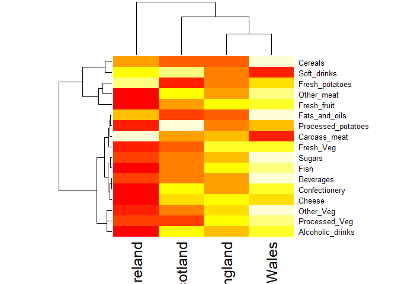
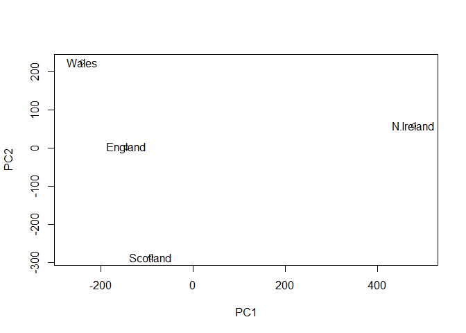
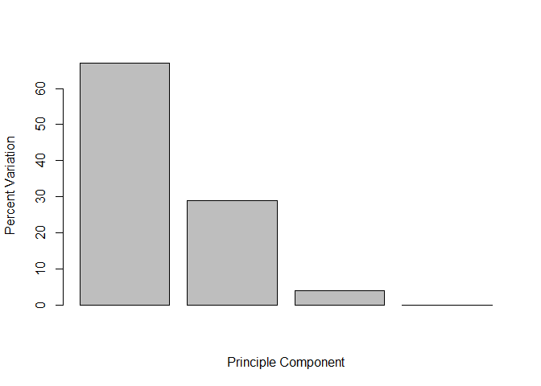
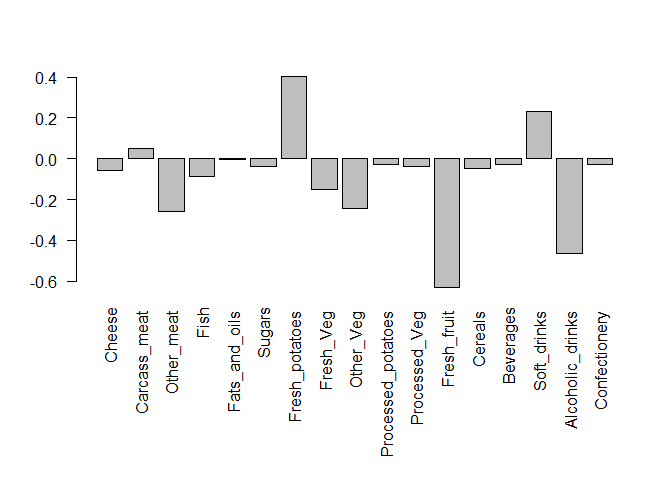
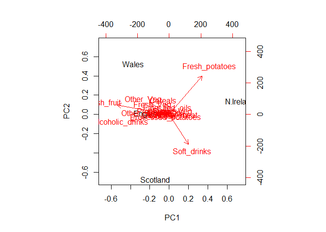
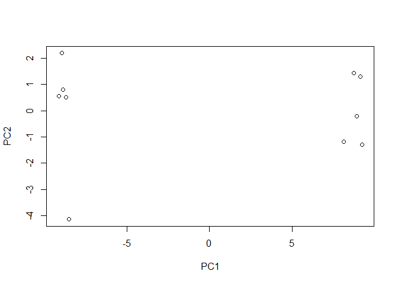
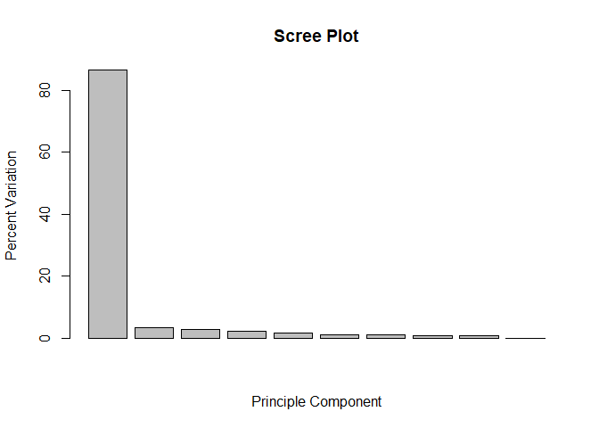
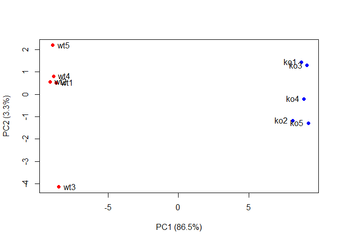

## UK Foods Report

Read the file into R

```r
data <- read.csv("https://bioboot.github.io/bimm143_S18/class-material/UK_foods.csv")

head(data)
```

```
##                X England Wales Scotland N.Ireland
## 1         Cheese     105   103      103        66
## 2  Carcass_meat      245   227      242       267
## 3    Other_meat      685   803      750       586
## 4           Fish     147   160      122        93
## 5 Fats_and_oils      193   235      184       209
## 6         Sugars     156   175      147       139
```

Head shows that our row names are included as a column, which we don't want

Set the first column of data to be the rownames of data

```r
rownames(data) <- data[,1]

# Take out the first line of data so that the rownames are no longer included
data <- data[,-1]

head(data)
```

```
##                England Wales Scotland N.Ireland
## Cheese             105   103      103        66
## Carcass_meat       245   227      242       267
## Other_meat         685   803      750       586
## Fish               147   160      122        93
## Fats_and_oils      193   235      184       209
## Sugars             156   175      147       139
```


Display our data as a rendered table using the Knitr package

```r
knitr::kable(data, caption = "The full UK foods data table")
```


Table: The full UK foods data table

                      England   Wales   Scotland   N.Ireland
-------------------  --------  ------  ---------  ----------
Cheese                    105     103        103          66
Carcass_meat              245     227        242         267
Other_meat                685     803        750         586
Fish                      147     160        122          93
Fats_and_oils             193     235        184         209
Sugars                    156     175        147         139
Fresh_potatoes            720     874        566        1033
Fresh_Veg                 253     265        171         143
Other_Veg                 488     570        418         355
Processed_potatoes        198     203        220         187
Processed_Veg             360     365        337         334
Fresh_fruit              1102    1137        957         674
Cereals                  1472    1582       1462        1494
Beverages                  57      73         53          47
Soft_drinks              1374    1256       1572        1506
Alcoholic_drinks          375     475        458         135
Confectionery              54      64         62          41

The raw numbers don't show any obvious trends, so lets apply a heatmap to the data

```r
heatmap(as.matrix(data))
```

<!-- -->

This helps emphasize the differences between countries, however it doesn't quantify the data

Let's use PCA to help us evaluate more closely

# PCA

Use prcomp() to perform a pca analysis

```r
# Remeber to transpose the dataset before using prcomp if your observations are columns and not rows
pca <- prcomp(t(data))

summary(pca)
```

```
## Importance of components:
##                             PC1      PC2      PC3       PC4
## Standard deviation     324.1502 212.7478 73.87622 4.189e-14
## Proportion of Variance   0.6744   0.2905  0.03503 0.000e+00
## Cumulative Proportion    0.6744   0.9650  1.00000 1.000e+00
```

By analyzing the above summary, we can see that our PCA has revealed that PC1 is responsible for 67% of the Perceived Variance!

Together with PC2, 96.5% of the Perceived Variance is explained. Clearly these are areas we want to explore more

Lets plot PC1 vs PC2

```r
plot(pca$x[,1], pca$x[,2], xlab = "PC1", ylab = "PC2", xlim = c(-270, 500) )

# Places the country names within the plot instead of simple points
text(pca$x[,1], pca$x[,2], colnames(data))
```

<!-- -->

Now lets access the PCE for each PC

```r
v <- round( pca$sdev^2/sum(pca$sdev^2) * 100)

# This displays the PVE for each PC from PC1 down through our list
v
```

```
## [1] 67 29  4  0
```

We can visualize this using a plot of the variances (the Eigenvalues) with respect to the Principle Component number (the Eigenvector numbers)

```r
barplot(v, xlab = "Principle Component", ylab = "Percent Variation")
```

<!-- -->

To show how much of the PVE is accounted for in our Principle Componenets, we can take the cumulative sum of our PVEs

```r
cumsum(v)
```

```
## [1]  67  96 100 100
```

To visualize the impact each of the original variables had on the PVE, we can look at the **Loading Scores** accessed by inspection of the pca$rotation componenet

```r
par(mar=c(10, 4, 4, 2))
barplot( pca$rotation[,1], las=2 )
```

<!-- -->

This shows us that the variables that push a country furthest to the positive side of the graph are those who consume more Fresh Potatoes and Soft Drinks. North Ireland was a major consumer of both, hence why North Ireland was found so strongly on the positive side.

We can also see that the variables that produced the largest negative scores were Fresh Fruit and Alcoholic Drinks. This explains the countries that are major consumers of these variables and find themselves to the negative side of the graph

We can see these ideas more easily represented in a biplot: This shows the countries and their positions along with the relative weights of each variable with their associated vectors. The magnitude of the vectors correlates with their weight within PC1.

```r
biplot(pca)
```

<!-- -->

## PAC on RNA-seq Data

First lets generate some sample data where:

Columns: Observations
Rows: Measurements

```r
# Just for the sake of the example, here's some made up data...
data.matrix <- matrix(nrow=100, ncol=10)

# Lets label the rows gene1, gene2 etc. to gene100
rownames(data.matrix) <- paste("gene", 1:100, sep="")

# Lets label the first 5 columns wt1, wt2, wt3, wt4 and wt5
#   and the last 5 ko1, ko2 etc. to ko5 (for "knock-out") 
colnames(data.matrix) <- c(
  paste("wt", 1:5, sep=""),
  paste("ko", 1:5, sep=""))

# Now fill in some fake read counts
for (i in 1:100) {
  wt.values <- rpois(5, lambda=sample(x=10:1000, size=1))
  ko.values <- rpois(5, lambda=sample(x=10:1000, size=1))
 
  data.matrix[i,] <- c(wt.values, ko.values)
}

head(data.matrix)
```

```
##       wt1 wt2 wt3 wt4 wt5 ko1 ko2 ko3 ko4 ko5
## gene1 718 687 666 709 751 859 817 794 774 841
## gene2 156 154 153 165 182 633 621 596 608 631
## gene3 389 379 395 424 430 351 344 304 339 318
## gene4 446 443 418 459 452  67  80  74  81  81
## gene5 148 165 162 174 163 257 255 261 246 255
## gene6 800 789 806 781 788 214 209 243 218 224
```

```r
# Citation: Bary J. Grant, BIMM143, 2018
```

Now that we have our data, look at the matrix: Our Samples(OBSERVATIONS) are Columns and our Genes are Rows. Remember that our prcomp() wants the Observations as Rows.

We need to transpose our matrix before using prcomp() on it.

Also, the values vary wildly, so make sure to set SCALE = TRUE.

```r
pca <- prcomp(t(data.matrix), scale = TRUE)

# Plot our PCA looking at PC1 vs. PC2
plot(pca$x[,1], pca$x[,2], xlab = "PC1", ylab = "PC2")
```

<!-- -->

Lets calculate how much variance each PC is responsible for (the Perceived Variance Explained)

```r
pca.var <- pca$sdev^2

pca.var.per <- round(pca.var/sum(pca.var) * 100, 1)
pca.var.per
```

```
##  [1] 86.5  3.3  2.8  2.1  1.6  1.1  0.9  0.8  0.7  0.0
```

Now use this data to generate our standard Scree-Plot

```r
barplot(pca.var.per, main = "Scree Plot", xlab = "Principle Component", ylab = "Percent Variation")
```

<!-- -->

Now lets add names and colors to our original PCA plot to make it more useful

```r
## A vector of colors for wt and ko samples
colvec <- colnames(data.matrix)
colvec[grep("wt", colvec)] <- "red"
colvec[grep("ko", colvec)] <- "blue"

plot(pca$x[,1], pca$x[,2], col=colvec, pch=16,
     xlab=paste0("PC1 (", pca.var.per[1], "%)"),
     ylab=paste0("PC2 (", pca.var.per[2], "%)"))

text(pca$x[,1], pca$x[,2], labels = colnames(data.matrix), pos=c(rep(4,5), rep(2,5)))
```

<!-- -->

```r
#Citation: Barry J Grant, BIMM143, 2018
```

Finally let's show the genes in order of those that contribute the most to PC1 (Loading Scores)

```r
loading_scores <- pca$rotation[,1]

## Find the top 10 measurements (genes) that contribute
## most to pc1 in eiter direction (+ or -)
gene_scores <- abs(loading_scores) 
gene_score_ranked <- sort(gene_scores, decreasing=TRUE)

## show the names of the top 10 genes
top_10_genes <- names(gene_score_ranked[1:10])
top_10_genes
```

```
##  [1] "gene63" "gene59" "gene93" "gene35" "gene89" "gene84" "gene11"
##  [8] "gene33" "gene53" "gene4"
```

