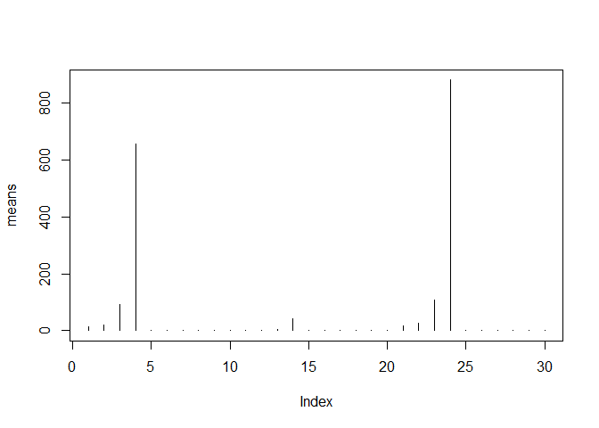
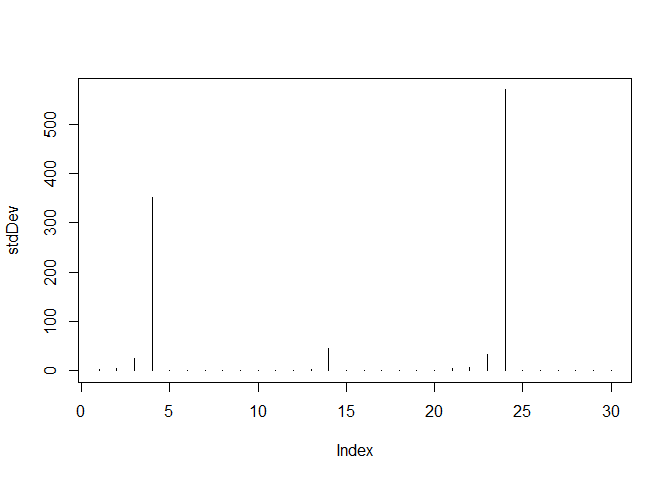
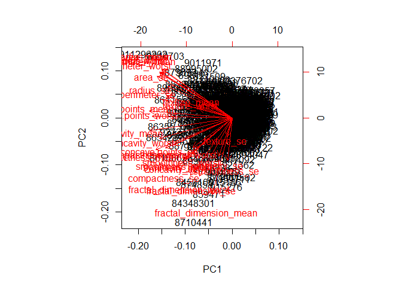
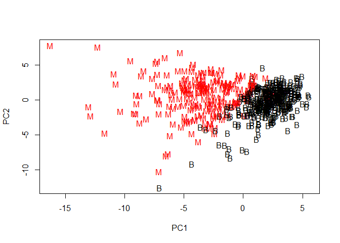
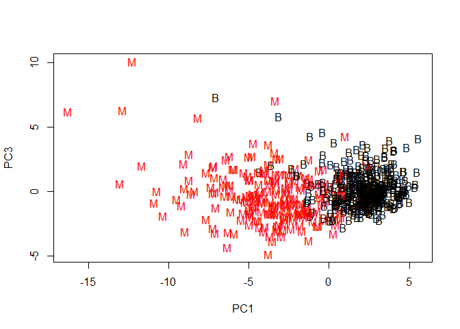
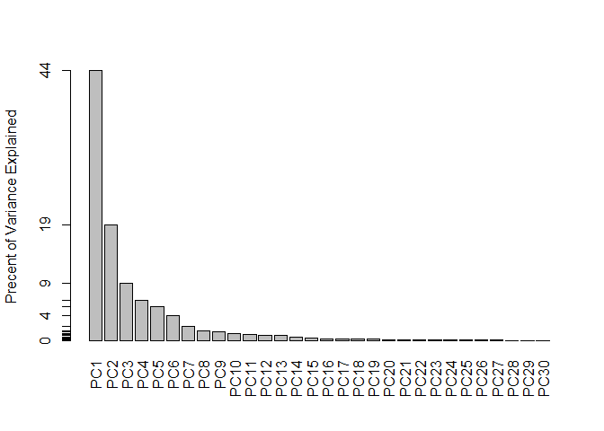
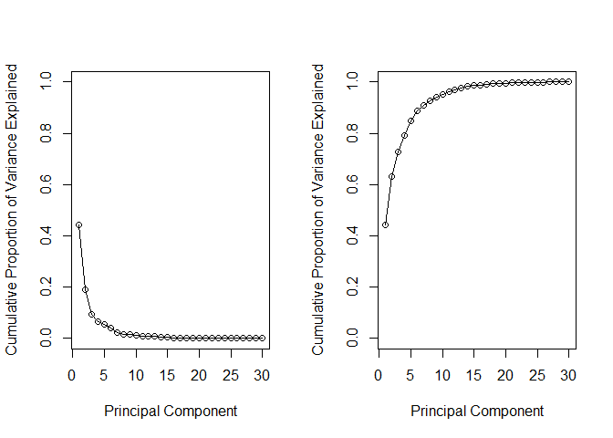
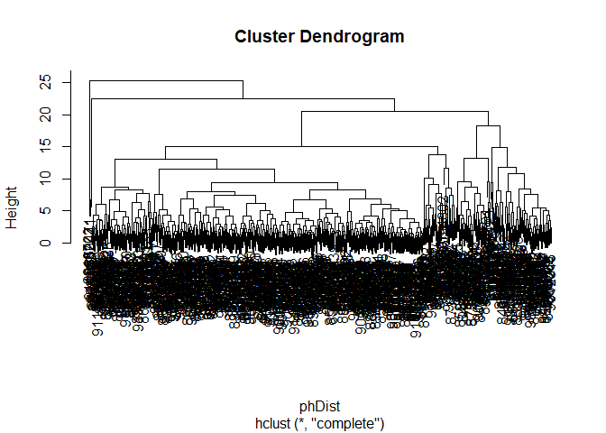

## Cancer Diagnostics

Read in the file and then format the data as we need it.


```r
wisc.df <- read.csv("https://bioboot.github.io/bimm143_S18/class-material/WisconsinCancer.csv")

wisc.data <- as.matrix(wisc.df[,3:32])

row.names(wisc.data) <- wisc.df$id

diagnosis <- as.numeric(wisc.df$diagnosis == "M")
```


**Q1** How many observations are in this dataset?

```r
nrow(wisc.data)
```

```
## [1] 569
```

- 569


**Q2** How many variables/features in the data are suffixed with _mean?

```r
cols <- colnames(wisc.data)
numOfMeans <- grep("mean", cols)
length(numOfMeans)
```

```
## [1] 10
```

- 10


**Q3** How many of the observations have a malignant diagnosis?

```r
sum(diagnosis)
```

```
## [1] 212
```

- 212


## Section 2: Performing PCA

Before performing the PCA, we need to check that the data is scaled. Do this using mean!


```r
means <- colMeans(wisc.data)
plot(means, typ = "h")
```

<!-- -->


```r
stdDev <- apply(wisc.data, 2, sd)
plot(stdDev, typ = "h")
```

<!-- -->


Now that we see the means and standard deviations, we can see that we definitely need to scale our data before running the PCA. Now lets actually apply the PCA algorithm!


```r
wisc.pr <- prcomp(wisc.data, scale = TRUE)
```


Lets look at the summary of the wisc.pr variable


```r
x <- summary(wisc.pr)
```


**Q4** From your results, what proportion of the original variance is captured by the first principal components (PC1)?

- 44.27%


Q5. How many principal components (PCs) are required to describe at least 70% of the original variance in the data?

- At least 3 PCs


Q6. How many principal components (PCs) are required to describe at least 90% of the original variance in the data?

- At least 7 PCs


## Interpreting the PCA

Now we need to visualize the data that we collected through the PCA


```r
biplot(wisc.pr)
```

<!-- -->

**Q7** What stands out to you about this plot? Is it easy or difficult to understand? Why?

- This graph is messy and doesn't offer much

The scatterplot would be better


```r
plot(wisc.pr$x[,1], wisc.pr$x[,2], col = (diagnosis + 1), pch = as.vector(wisc.df$diagnosis), xlab = "PC1", ylab = "PC2")
```

<!-- -->


**Q8** Repeat the same for principal components 1 and 3. What do you notice about these plots?


```r
plot(wisc.pr$x[,1], wisc.pr$x[,3], col = (diagnosis + 1), pch = as.vector(wisc.df$diagnosis), xlab = "PC1", ylab = "PC3")
```

<!-- -->

- They show a similar grouping of the data


## Generate a Scree-Plot

Now we need to extract the Percent Variance Explained from the wisc.pr data


```r
attributes(wisc.pr)
```

```
## $names
## [1] "sdev"     "rotation" "center"   "scale"    "x"       
## 
## $class
## [1] "prcomp"
```


We see the sdev data, which we can use to get the PVE


```r
# Calculates the variance of the componenets
pr.var <- wisc.pr$sdev^2

# Find the PVE value
pve <- pr.var / sum(pr.var)
```


Now we can graph the Scree-Plot with the PVE


```r
# Plot of variance explained for each principal component
barplot(pve, ylab = "Precent of Variance Explained",
     names.arg=paste0("PC",1:length(pve)), las=2, axes = FALSE)
axis(2, at=pve, labels=round(pve,2)*100 )
```

<!-- -->


Now lets try to plot the cumulative proportion of variance explained


```r
par(mfrow=c(1,2))

plot( pve, xlab = "Principal Component", 
     ylab = "Cumulative Proportion of Variance Explained", 
     ylim = c(0, 1), type = "o")

plot( cumsum(pve), xlab = "Principal Component", 
     ylab = "Cumulative Proportion of Variance Explained", 
     ylim = c(0, 1), type = "o")
```

<!-- -->


## Using Hierarchical Clustering Models on the Data

This will help us determine if supervised learning would be better or worse than the unsupervised learning provided by PCA


```r
# Scale the wisc.data
data.scaled <- scale(wisc.data)

# Calculate the Euclidian distance needed for the hclust algorithm
data.dist <- dist(data.scaled)

# Clustering by hclust
wisc.hclust <- hclust(data.dist)
```


Now lets plot the tree


```r
plot(wisc.hclust)
```

<!-- -->


The tree is much too crowded to gain any insight into the data, so lets cut the tree to make the results more readable. Lets look at *4* groups.


```r
wisc.hclust.clusters <- cutree(wisc.hclust, k = 4)
```


Examine the cut section


```r
# This generates the table and alligns the data with the diagnosis vector we generated earlier
# 1 denotes Cancer, 0 denotes Benign
table(wisc.hclust.clusters, diagnosis)
```

```
##                     diagnosis
## wisc.hclust.clusters   0   1
##                    1  12 165
##                    2   2   5
##                    3 343  40
##                    4   0   2
```


This gives us a pretty good idea about how the cluster correlate to cancer, however there are still some false positives and false negatives.

Maybe a different number of clusters would provide more accurate results?


## Kmeans on our Data

Now lets try Kmeans vs. Hierarchical


```r
# First lets scale our data
wisc.km <- kmeans(scale(wisc.data), centers = 2, nstart = 20)
```


Now lets see how this perfored


```r
table(wisc.km$cluster, diagnosis)
```

```
##    diagnosis
##       0   1
##   1  14 175
##   2 343  37
```


Compare our hierarchical data groupings to our k-means data grouping


```r
table(wisc.hclust.clusters, wisc.km$cluster)
```

```
##                     
## wisc.hclust.clusters   1   2
##                    1 160  17
##                    2   7   0
##                    3  20 363
##                    4   2   0
```


## Clustering on PCA Results

Let's try to combine the PCA with clustering that we know


```r
# Scale
# phScaled <- scale(wisc.pr$x[,1:7])

# Calculate distance
phDist <- dist(wisc.pr$x[,1:7])

# Generated the hclust
wisc.pr.hclust <- hclust(phDist)
```


Now lets plot it


```r
plot(wisc.pr.hclust)
```

<!-- -->


Lets cut the tree to be more understandable


```r
wisc.pr.hclust.clusters <- cutree(wisc.pr.hclust, k = 4)
```


Now lets compare the results we just received to the diagnosis


```r
table(wisc.pr.hclust.clusters, diagnosis)
```

```
##                        diagnosis
## wisc.pr.hclust.clusters   0   1
##                       1   5 113
##                       2 350  97
##                       3   2   0
##                       4   0   2
```

