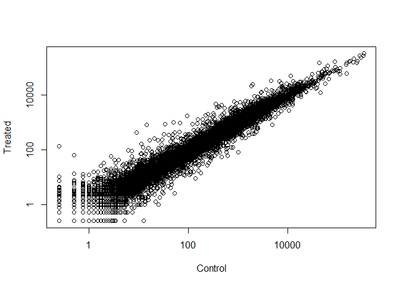

## Transcriptomics: RNA-Seq Continued

First lets grab our file:


```r
counts <- read.csv("data/airway_scaledcounts.csv", stringsAsFactors = FALSE)
```

And now lets grab our metadata:


```r
metadata <- read.csv("data/airway_metadata.csv", stringsAsFactors = FALSE)
```

To learn how to do basic differential expression analysis, we will use this sample data. **This is not the way we would do differential expression analysis normally!**

Let's find the mean amount of counts between the genes:


```r
# This grabs only the control samples from our Metadata
control <- metadata[metadata[,"dex"]=="control",]

# Calculate the mean
control.mean <- rowSums( counts[,control$id] ) / nrow(control)

# This will name the samples based on the names from the original Counts data
names(control.mean) <- counts$ensgene
```

*Question 1: How would we make the code more robust?*
  -We could replace the "4" with the count of the rows of "control"(example seen above)
  
*Question 2: Follow the same procedure for the treated samples:*
  -See following code
  

```r
treated <- metadata[metadata[,"dex"]=="treated",]
treated.mean <- rowSums( counts[,treated$id] ) / nrow(treated)
names(treated.mean) <- counts$ensgene
```

Now lets combine our meancount data just to collate our data:


```r
meancounts <- data.frame(control.mean, treated.mean)
```

Now lets inspect our new meancounts dataframe:


```r
colSums(meancounts)
```

```
## control.mean treated.mean 
##     23005324     22196524
```

And lets use a scatterplot to help us visualize the data:


```r
# We used the log option here to show all the data we need
plot(meancounts$control.mean, meancounts$treated.mean, log = "xy", xlab = "Control", ylab = "Treated")
```

```
## Warning in xy.coords(x, y, xlabel, ylabel, log): 15032 x values <= 0
## omitted from logarithmic plot
```

```
## Warning in xy.coords(x, y, xlabel, ylabel, log): 15281 y values <= 0
## omitted from logarithmic plot
```

<!-- -->

Now lets look for genes with a large change between control and treated samples. This is generally done by loooking at the log2 of the fold change (for mathematical reasons).

Lets calculate the log2foldchange, then add that to our meancouts dataframe:


```r
meancounts$log2fc <- log2(meancounts[,"treated.mean"]/meancounts[,"control.mean"])

# Inspect meancounts to see if we added the column
head(meancounts)
```

```
##                 control.mean treated.mean      log2fc
## ENSG00000000003       900.75       658.00 -0.45303916
## ENSG00000000005         0.00         0.00         NaN
## ENSG00000000419       520.50       546.00  0.06900279
## ENSG00000000457       339.75       316.50 -0.10226805
## ENSG00000000460        97.25        78.75 -0.30441833
## ENSG00000000938         0.75         0.00        -Inf
```

We notice that the data contains positives and negatives. These represent the affect the treatment or non-treatment has had on expression. The *positive* results represent an increase in expression, while the *negative* results represent a decrease in expression.

We can see that there are some strange results:

  -NaN: Results when you divide by zero and attempt to take the log
  -InF: Trying to take the log of zero
  
We need to remove the data from those genes that showed zero expression! We need to filter our data:


```r
zero.vals <- which(meancounts[,1:2]==0, arr.ind = TRUE)

to.rm <- unique(zero.vals[,1])
mycounts <- meancounts[-to.rm,]
head(mycounts)
```

```
##                 control.mean treated.mean      log2fc
## ENSG00000000003       900.75       658.00 -0.45303916
## ENSG00000000419       520.50       546.00  0.06900279
## ENSG00000000457       339.75       316.50 -0.10226805
## ENSG00000000460        97.25        78.75 -0.30441833
## ENSG00000000971      5219.00      6687.50  0.35769358
## ENSG00000001036      2327.00      1785.75 -0.38194109
```

*Question 4: What is the purpose of the arr.ind arguement in the which() function call?*
  -This indicates whether or not the array indices should be returned when the           meancounts[,1:2] == 0 is found within the array
  
We can use a threshold for determining if something actually is differentially expressed by looking at the log2(FoldChange). If the reults is greater than 2, or less than -2, then we probably have conclusive data.

Let's see which genes are up-regulated and which are down-regulated:


```r
up.ind <- mycounts$log2fc > 2
upCount <- sum(up.ind)
down.ind <- mycounts$log2fc < (-2)
downCount <- sum(down.ind)

# And a nice way of displaying the data:
paste("The number of UP-regulated genes:", upCount)
```

```
## [1] "The number of UP-regulated genes: 250"
```

```r
paste("The number of DOWN-regulated genes:", downCount)
```

```
## [1] "The number of DOWN-regulated genes: 367"
```

*Question 5: Using up.ind and down.ind, how many up-regulated and down-regulated genes do we have?*
  -Up: 250
  -Down: 367
  
This represents 617 total differentially expressed genes (in either direction). Quite a lot!

## Adding Annotation Data

Lets add annotation to our data now:


```r
anno <- read.csv("data/annotables_grch38.csv", stringsAsFactors = FALSE)

# Check the contents
head(anno)
```

```
##           ensgene entrez   symbol chr     start       end strand
## 1 ENSG00000000003   7105   TSPAN6   X 100627109 100639991     -1
## 2 ENSG00000000005  64102     TNMD   X 100584802 100599885      1
## 3 ENSG00000000419   8813     DPM1  20  50934867  50958555     -1
## 4 ENSG00000000457  57147    SCYL3   1 169849631 169894267     -1
## 5 ENSG00000000460  55732 C1orf112   1 169662007 169854080      1
## 6 ENSG00000000938   2268      FGR   1  27612064  27635277     -1
##          biotype
## 1 protein_coding
## 2 protein_coding
## 3 protein_coding
## 4 protein_coding
## 5 protein_coding
## 6 protein_coding
##                                                                                                  description
## 1                                                          tetraspanin 6 [Source:HGNC Symbol;Acc:HGNC:11858]
## 2                                                            tenomodulin [Source:HGNC Symbol;Acc:HGNC:17757]
## 3 dolichyl-phosphate mannosyltransferase polypeptide 1, catalytic subunit [Source:HGNC Symbol;Acc:HGNC:3005]
## 4                                               SCY1-like, kinase-like 3 [Source:HGNC Symbol;Acc:HGNC:19285]
## 5                                    chromosome 1 open reading frame 112 [Source:HGNC Symbol;Acc:HGNC:25565]
## 6                          FGR proto-oncogene, Src family tyrosine kinase [Source:HGNC Symbol;Acc:HGNC:3697]
```

We want this annotated data mapped (or **merged**) with the mycounts data. Maybe we should use the merge() function? (Yes. Yes we should.)

*Question 6: Can we set the by.x and by.y arguments in the merge() function to appropriately annotate the mycounts dataframe?*
  -See code below
  

```r
results <- merge(mycounts, anno, by.x = "row.names", by.y = "ensgene")

head(results)
```

```
##         Row.names control.mean treated.mean      log2fc entrez   symbol
## 1 ENSG00000000003       900.75       658.00 -0.45303916   7105   TSPAN6
## 2 ENSG00000000419       520.50       546.00  0.06900279   8813     DPM1
## 3 ENSG00000000457       339.75       316.50 -0.10226805  57147    SCYL3
## 4 ENSG00000000460        97.25        78.75 -0.30441833  55732 C1orf112
## 5 ENSG00000000971      5219.00      6687.50  0.35769358   3075      CFH
## 6 ENSG00000001036      2327.00      1785.75 -0.38194109   2519    FUCA2
##   chr     start       end strand        biotype
## 1   X 100627109 100639991     -1 protein_coding
## 2  20  50934867  50958555     -1 protein_coding
## 3   1 169849631 169894267     -1 protein_coding
## 4   1 169662007 169854080      1 protein_coding
## 5   1 196651878 196747504      1 protein_coding
## 6   6 143494811 143511690     -1 protein_coding
##                                                                                                  description
## 1                                                          tetraspanin 6 [Source:HGNC Symbol;Acc:HGNC:11858]
## 2 dolichyl-phosphate mannosyltransferase polypeptide 1, catalytic subunit [Source:HGNC Symbol;Acc:HGNC:3005]
## 3                                               SCY1-like, kinase-like 3 [Source:HGNC Symbol;Acc:HGNC:19285]
## 4                                    chromosome 1 open reading frame 112 [Source:HGNC Symbol;Acc:HGNC:25565]
## 5                                                     complement factor H [Source:HGNC Symbol;Acc:HGNC:4883]
## 6                                          fucosidase, alpha-L- 2, plasma [Source:HGNC Symbol;Acc:HGNC:4008]
```

Now we have our annotated data! Usually though, this is done through Bioconductor:


```r
#source("http://bioconductor.org/biocLite.R")
#biocLite()

#biocLite("org.Hs.eg.db")

library("AnnotationDbi")
```

```
## Loading required package: stats4
```

```
## Loading required package: BiocGenerics
```

```
## Loading required package: parallel
```

```
## 
## Attaching package: 'BiocGenerics'
```

```
## The following objects are masked from 'package:parallel':
## 
##     clusterApply, clusterApplyLB, clusterCall, clusterEvalQ,
##     clusterExport, clusterMap, parApply, parCapply, parLapply,
##     parLapplyLB, parRapply, parSapply, parSapplyLB
```

```
## The following objects are masked from 'package:stats':
## 
##     IQR, mad, sd, var, xtabs
```

```
## The following objects are masked from 'package:base':
## 
##     anyDuplicated, append, as.data.frame, cbind, colMeans,
##     colnames, colSums, do.call, duplicated, eval, evalq, Filter,
##     Find, get, grep, grepl, intersect, is.unsorted, lapply,
##     lengths, Map, mapply, match, mget, order, paste, pmax,
##     pmax.int, pmin, pmin.int, Position, rank, rbind, Reduce,
##     rowMeans, rownames, rowSums, sapply, setdiff, sort, table,
##     tapply, union, unique, unsplit, which, which.max, which.min
```

```
## Loading required package: Biobase
```

```
## Welcome to Bioconductor
## 
##     Vignettes contain introductory material; view with
##     'browseVignettes()'. To cite Bioconductor, see
##     'citation("Biobase")', and for packages 'citation("pkgname")'.
```

```
## Loading required package: IRanges
```

```
## Loading required package: S4Vectors
```

```
## 
## Attaching package: 'S4Vectors'
```

```
## The following object is masked from 'package:base':
## 
##     expand.grid
```

```r
library("org.Hs.eg.db")
```

```
## 
```


```r
columns(org.Hs.eg.db)
```

```
##  [1] "ACCNUM"       "ALIAS"        "ENSEMBL"      "ENSEMBLPROT" 
##  [5] "ENSEMBLTRANS" "ENTREZID"     "ENZYME"       "EVIDENCE"    
##  [9] "EVIDENCEALL"  "GENENAME"     "GO"           "GOALL"       
## [13] "IPI"          "MAP"          "OMIM"         "ONTOLOGY"    
## [17] "ONTOLOGYALL"  "PATH"         "PFAM"         "PMID"        
## [21] "PROSITE"      "REFSEQ"       "SYMBOL"       "UCSCKG"      
## [25] "UNIGENE"      "UNIPROT"
```

# DESeq2 Analysis

Load the DESeq2 package


```r
library(DESeq2)
```

```
## Loading required package: GenomicRanges
```

```
## Loading required package: GenomeInfoDb
```

```
## Loading required package: SummarizedExperiment
```

```
## Loading required package: DelayedArray
```

```
## Loading required package: matrixStats
```

```
## 
## Attaching package: 'matrixStats'
```

```
## The following objects are masked from 'package:Biobase':
## 
##     anyMissing, rowMedians
```

```
## 
## Attaching package: 'DelayedArray'
```

```
## The following objects are masked from 'package:matrixStats':
## 
##     colMaxs, colMins, colRanges, rowMaxs, rowMins, rowRanges
```

```
## The following object is masked from 'package:base':
## 
##     apply
```

```r
citation("DESeq2")
```

```
## 
##   Love, M.I., Huber, W., Anders, S. Moderated estimation of fold
##   change and dispersion for RNA-seq data with DESeq2 Genome
##   Biology 15(12):550 (2014)
## 
## A BibTeX entry for LaTeX users is
## 
##   @Article{,
##     title = {Moderated estimation of fold change and dispersion for RNA-seq data with DESeq2},
##     author = {Michael I. Love and Wolfgang Huber and Simon Anders},
##     year = {2014},
##     journal = {Genome Biology},
##     doi = {10.1186/s13059-014-0550-8},
##     volume = {15},
##     issue = {12},
##     pages = {550},
##   }
```

Now lets prepate our DESeq Data Set Object:


```r
dds <- DESeqDataSetFromMatrix(countData = counts,
                              colData = metadata,
                              design = ~dex,
                              tidy = TRUE)
```

```
## converting counts to integer mode
```

```
## Warning in DESeqDataSet(se, design = design, ignoreRank): some variables in
## design formula are characters, converting to factors
```

```r
head(dds)
```

```
## class: DESeqDataSet 
## dim: 6 8 
## metadata(1): version
## assays(1): counts
## rownames(6): ENSG00000000003 ENSG00000000005 ... ENSG00000000460
##   ENSG00000000938
## rowData names(0):
## colnames(8): SRR1039508 SRR1039509 ... SRR1039520 SRR1039521
## colData names(4): id dex celltype geo_id
```

Lets run the DESeq pipeline on our dataset:


```r
sizeFactors(dds)
```

```
## NULL
```

```r
dispersions(dds)
```

```
## NULL
```

```r
dds <- DESeq(dds)
```

```
## estimating size factors
```

```
## estimating dispersions
```

```
## gene-wise dispersion estimates
```

```
## mean-dispersion relationship
```

```
## final dispersion estimates
```

```
## fitting model and testing
```

```r
res <- results(dds)
head(res)
```

```
## log2 fold change (MLE): dex treated vs control 
## Wald test p-value: dex treated vs control 
## DataFrame with 6 rows and 6 columns
##                    baseMean log2FoldChange     lfcSE       stat     pvalue
##                   <numeric>      <numeric> <numeric>  <numeric>  <numeric>
## ENSG00000000003 747.1941954    -0.35070283 0.1682342 -2.0846111 0.03710462
## ENSG00000000005   0.0000000             NA        NA         NA         NA
## ENSG00000000419 520.1341601     0.20610652 0.1010134  2.0403876 0.04131173
## ENSG00000000457 322.6648439     0.02452714 0.1451103  0.1690242 0.86577762
## ENSG00000000460  87.6826252    -0.14714409 0.2569657 -0.5726216 0.56690095
## ENSG00000000938   0.3191666    -1.73228897 3.4936010 -0.4958463 0.62000288
##                      padj
##                 <numeric>
## ENSG00000000003 0.1630257
## ENSG00000000005        NA
## ENSG00000000419 0.1757326
## ENSG00000000457 0.9616577
## ENSG00000000460 0.8157061
## ENSG00000000938        NA
```

The "padj" column is the p-value that has been adjusted by the DESeq algorithm to account for false positives. Compare this to the "pvalue" to see what our data is actually telling us.

Now lets look at some basic tallies of the data from our results:


```r
summary(res)
```

```
## 
## out of 25258 with nonzero total read count
## adjusted p-value < 0.1
## LFC > 0 (up)     : 1564, 6.2% 
## LFC < 0 (down)   : 1188, 4.7% 
## outliers [1]     : 142, 0.56% 
## low counts [2]   : 9971, 39% 
## (mean count < 10)
## [1] see 'cooksCutoff' argument of ?results
## [2] see 'independentFiltering' argument of ?results
```

Now lets order our data by the sallest pvalue:


```r
# The 'order' command here returns the indices of the sorted data, but doesn't actually sort them. This is important because it allows us to reorder our entire dataframe and not just one part of our data!
resOrdered <- res[order(res$pvalue),]
```

The default pvalue cutoff is 0.1, however we know that in general, we want a p-value around 0.05. We can account for this by applying our own filter:


```r
res05 <- results(dds, alpha = 0.05)
summary(res05)
```

```
## 
## out of 25258 with nonzero total read count
## adjusted p-value < 0.05
## LFC > 0 (up)     : 1237, 4.9% 
## LFC < 0 (down)   : 933, 3.7% 
## outliers [1]     : 142, 0.56% 
## low counts [2]   : 9033, 36% 
## (mean count < 6)
## [1] see 'cooksCutoff' argument of ?results
## [2] see 'independentFiltering' argument of ?results
```

*Question 9: How many significant results did we find with a p-value of < 0.05? < 0.01? Save the later as a set of results called resSig01.*
  -See below code
  

```r
res01 <- results(dds, alpha = 0.01)
summary(res01)
```

```
## 
## out of 25258 with nonzero total read count
## adjusted p-value < 0.01
## LFC > 0 (up)     : 850, 3.4% 
## LFC < 0 (down)   : 582, 2.3% 
## outliers [1]     : 142, 0.56% 
## low counts [2]   : 9033, 36% 
## (mean count < 6)
## [1] see 'cooksCutoff' argument of ?results
## [2] see 'independentFiltering' argument of ?results
```

*Question 10: Add annotations to our res01 dataframe.*
  -See below code
  

```r
res01.df <- as.data.frame(res01)
resSig01 <- merge(res01.df, anno, by.x = "row.names", by.y = "ensgene")
```

Now lets view our results by the adjusted p-value:


```r
ord <- order(resSig01$padj)
head(resSig01[ord,])
```

```
##             Row.names   baseMean log2FoldChange      lfcSE      stat
## 9607  ENSG00000152583   954.7709       4.368359 0.23713648  18.42129
## 14630 ENSG00000179094   743.2527       2.863888 0.17555825  16.31304
## 4622  ENSG00000116584  2277.9135      -1.034700 0.06505273 -15.90556
## 16884 ENSG00000189221  2383.7537       3.341544 0.21241508  15.73120
## 5051  ENSG00000120129  3440.7038       2.965211 0.20370277  14.55656
## 9104  ENSG00000148175 13493.9204       1.427168 0.10036663  14.21955
##             pvalue         padj entrez  symbol chr     start       end
## 9607  8.867079e-76 1.426092e-71   8404 SPARCL1   4  87473335  87531061
## 14630 7.972621e-60 6.411183e-56   5187    PER1  17   8140472   8156506
## 4622  5.798513e-57 3.108583e-53   9181 ARHGEF2   1 155946851 156007070
## 16884 9.244206e-56 3.716864e-52   4128    MAOA   X  43654907  43746824
## 5051  5.306416e-48 1.706862e-44   1843   DUSP1   5 172768090 172771195
## 9104  6.929711e-46 1.857509e-42   2040    STOM   9 121338988 121370304
##       strand        biotype
## 9607      -1 protein_coding
## 14630     -1 protein_coding
## 4622      -1 protein_coding
## 16884      1 protein_coding
## 5051      -1 protein_coding
## 9104      -1 protein_coding
##                                                                                description
## 9607                              SPARC-like 1 (hevin) [Source:HGNC Symbol;Acc:HGNC:11220]
## 14630                          period circadian clock 1 [Source:HGNC Symbol;Acc:HGNC:8845]
## 4622  Rho/Rac guanine nucleotide exchange factor (GEF) 2 [Source:HGNC Symbol;Acc:HGNC:682]
## 16884                               monoamine oxidase A [Source:HGNC Symbol;Acc:HGNC:6833]
## 5051                     dual specificity phosphatase 1 [Source:HGNC Symbol;Acc:HGNC:3064]
## 9104                                           stomatin [Source:HGNC Symbol;Acc:HGNC:3383]
```

Finally lets write out our significant results with our added annotations:


```r
write.csv(resSig01[ord,], "signif01_results.csv")
```


# Data Visualization

The DESeq2 package offers a function that takes the DESeqDataSet object that we created, the name of a gene, and the name of a variable in the colData that we're interested in.

Lets inspect the gene ID for the CRISPLD2 gene:


```r
i <- grep("CRISPLD2", resSig01$symbol)
resSig01[i,]
```

```
##            Row.names baseMean log2FoldChange     lfcSE     stat
## 2795 ENSG00000103196 3096.159       2.626034 0.2674705 9.818031
##            pvalue         padj entrez   symbol chr    start      end
## 2795 9.416441e-23 3.605824e-20  83716 CRISPLD2  16 84819984 84920768
##      strand        biotype
## 2795      1 protein_coding
##                                                                                       description
## 2795 cysteine-rich secretory protein LCCL domain containing 2 [Source:HGNC Symbol;Acc:HGNC:25248]
```

```r
rownames(resSig01[i,])
```

```
## [1] "2795"
```

