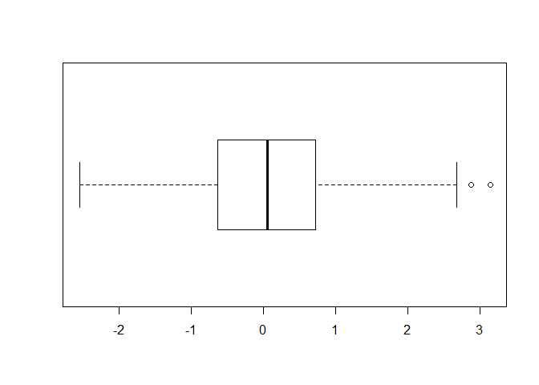
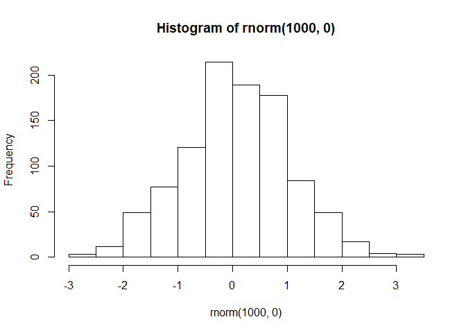
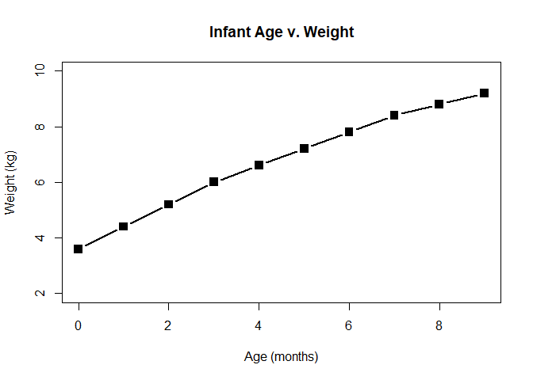
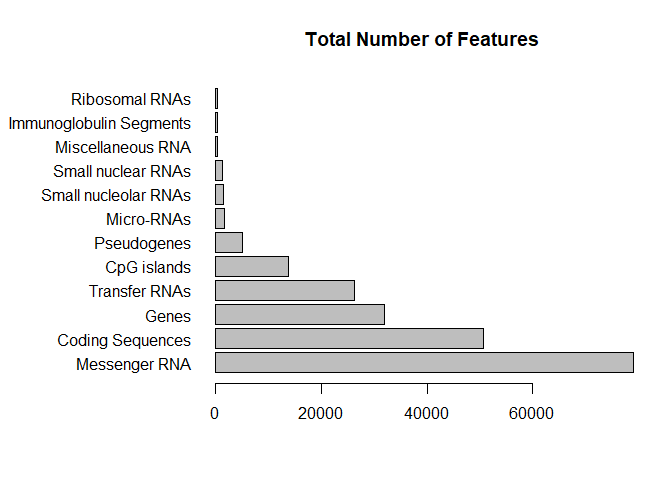
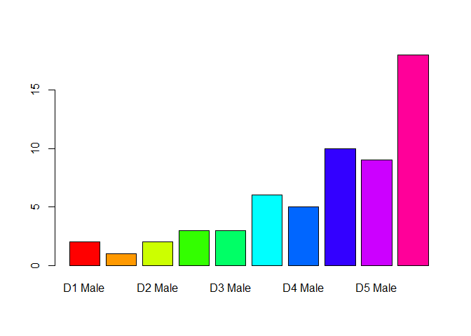
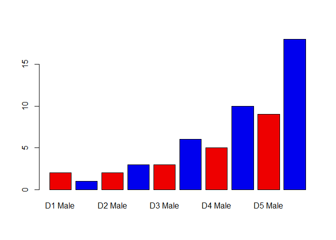
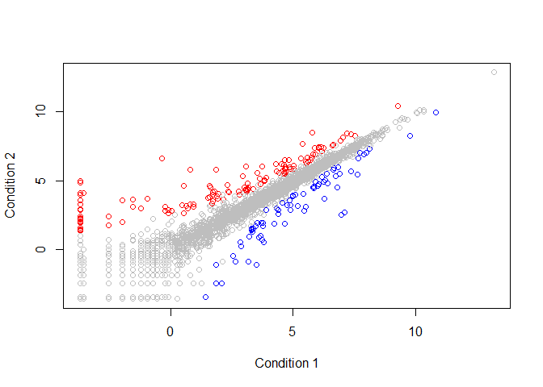
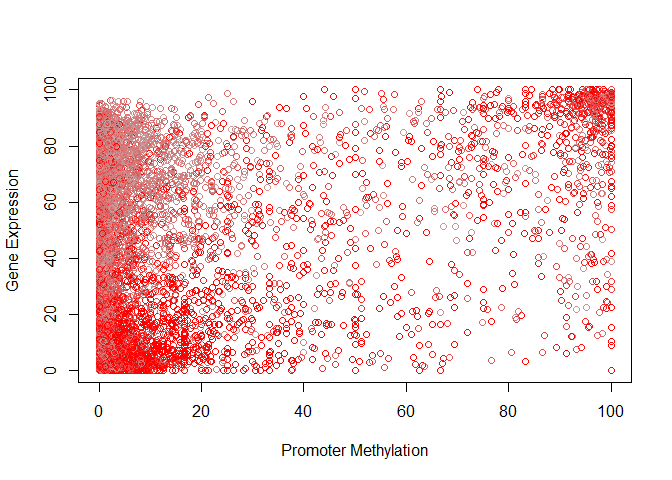

## R Basics: Working With Graphs

First lets practice making a Boxplot and a Histogram using sample data from R:


```r
# boxplot
boxplot( rnorm(1000,0), horizontal = TRUE )
```

<!-- -->

```r
# histogram
hist( rnorm(1000,0) )
```

<!-- -->

```r
# summary shows basic statistics about the data being plotted
summary( rnorm(1000,0) )
```

```
##     Min.  1st Qu.   Median     Mean  3rd Qu.     Max. 
## -3.74151 -0.67662 -0.02106 -0.03099  0.63364  3.03543
```

Now that we know how to use some basic plots, lets explore some data.

We will need to read in a file:


```r
# Read first data file
weight_df <- read.table("bimm143_05_rstats/weight_chart.txt", header=TRUE)

# Plot the dataframe
plot(weight_df, type="b", pch=15, cex=1.5, lwd=2, ylim=c(2,10), xlab="Age (months)", ylab="Weight (kg)", main="Infant Age v. Weight")
```

<!-- -->

Looks good!

Let's try it again with a different data set and a barplot:


```r
# Read second data file
feature_df <- read.table("bimm143_05_rstats/feature_counts.txt", sep="\t", header=TRUE)

# Had to change the margins due to the longer y-axis labels
par( mar=c(5,11,4,2) )

# The plotted data
barplot(feature_df[,2], horiz=TRUE, names.arg=feature_df[,1], main="Total Number of Features", las=1)
```

<!-- -->

## More Advanced Graphing

Lets experiment with coloration within the graphs:


```r
# Read file
mfFile <- "bimm143_05_rstats/male_female_counts.txt"
mf_count <- read.table(mfFile, header=TRUE, sep="\t")
color_vector=rainbow(nrow(mf_count))

# Barplot of file: rainbow colors
barplot(mf_count$Count, col=color_vector, names.arg=mf_count$Sample)
```

<!-- -->

```r
# Barplot of file: red and blue
barplot(mf_count$Count, col=c("red2", "blue2"), names.arg=mf_count$Sample)
```

<!-- -->

And here are some graphs relating to up and down regulation of genes:


```r
# Read file
upDownFile <- "bimm143_05_rstats/up_down_expression.txt"
up_down <- read.table(upDownFile, header=TRUE, sep="\t")
palette(c("Blue", "Grey", "Red"))

# Scatterplot of Condition1 v. Condition2
plot(up_down$Condition1, up_down$Condition2, col=up_down$State, xlab = "Condition 1", ylab = "Condition 2")
```

<!-- -->

Lets try to use the same concepts to visualize the correlation between methylation and expression:


```r
# Run r file and read text file
source("bimm143_05_rstats/color_to_value_map.r")
exprMethFile <- "bimm143_05_rstats/expression_methylation.txt"

# Read Expression Methylation File
exp_meth <- read.delim(exprMethFile)
high <- max(exp_meth$expression)
low <- min(exp_meth$expression)
highLow <- c(high, low)

# Scatterplot of Promoter v. Gene
setOfColors <- (colorRampPalette(c("grey", "red")) (100))
methColorVector <- map.colors(exp_meth$expression, highLow, setOfColors)
plot(exp_meth$promoter.meth, exp_meth$gene.meth, col=methColorVector, xlab = "Promoter Methylation", ylab = "Gene Expression")
```

<!-- -->


