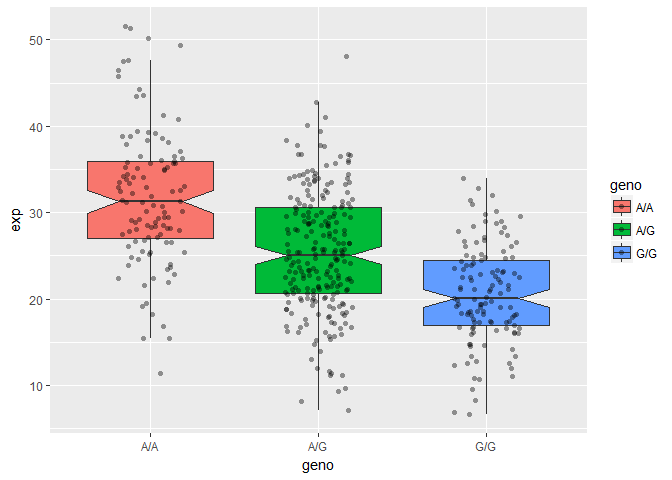

## Identifying SNP's in a Population

Lets analyze SNP's from the Mexican-American population in Los Angeles:


```r
genotype <- read.csv("373531-SampleGenotypes-Homo_sapiens_Variation_Sample_rs8067378.csv")
```

Now lets look at a table of the data:


```r
table(genotype)
```

```
## , , Population.s. = ALL, AMR, MXL, Father = -, Mother = -
## 
##                             Genotype..forward.strand.
## Sample..Male.Female.Unknown. A|A A|G G|A G|G
##                  NA19648 (F)   1   0   0   0
##                  NA19649 (M)   0   0   0   1
##                  NA19651 (F)   1   0   0   0
##                  NA19652 (M)   0   0   0   1
##                  NA19654 (F)   0   0   0   1
##                  NA19655 (M)   0   1   0   0
##                  NA19657 (F)   0   1   0   0
##                  NA19658 (M)   1   0   0   0
##                  NA19661 (M)   0   1   0   0
##                  NA19663 (F)   1   0   0   0
##                  NA19664 (M)   0   0   1   0
##                  NA19669 (F)   1   0   0   0
##                  NA19670 (M)   1   0   0   0
##                  NA19676 (M)   0   0   0   1
##                  NA19678 (F)   1   0   0   0
##                  NA19679 (M)   0   1   0   0
##                  NA19681 (F)   0   1   0   0
##                  NA19682 (M)   0   1   0   0
##                  NA19684 (F)   0   1   0   0
##                  NA19716 (F)   0   0   1   0
##                  NA19717 (M)   0   1   0   0
##                  NA19719 (F)   0   0   0   1
##                  NA19720 (M)   0   0   0   1
##                  NA19722 (F)   0   0   1   0
##                  NA19723 (M)   0   0   0   1
##                  NA19725 (F)   0   1   0   0
##                  NA19726 (M)   1   0   0   0
##                  NA19728 (F)   1   0   0   0
##                  NA19729 (M)   0   1   0   0
##                  NA19731 (F)   1   0   0   0
##                  NA19732 (M)   0   1   0   0
##                  NA19734 (F)   0   0   1   0
##                  NA19735 (M)   0   0   0   1
##                  NA19740 (F)   1   0   0   0
##                  NA19741 (M)   1   0   0   0
##                  NA19746 (F)   1   0   0   0
##                  NA19747 (M)   0   0   1   0
##                  NA19749 (F)   0   1   0   0
##                  NA19750 (M)   0   1   0   0
##                  NA19752 (F)   0   1   0   0
##                  NA19755 (F)   1   0   0   0
##                  NA19756 (M)   0   0   1   0
##                  NA19758 (F)   0   1   0   0
##                  NA19759 (M)   0   0   1   0
##                  NA19761 (F)   0   0   1   0
##                  NA19762 (M)   1   0   0   0
##                  NA19764 (F)   1   0   0   0
##                  NA19770 (F)   0   1   0   0
##                  NA19771 (M)   1   0   0   0
##                  NA19773 (F)   1   0   0   0
##                  NA19774 (M)   0   1   0   0
##                  NA19776 (F)   0   1   0   0
##                  NA19777 (M)   1   0   0   0
##                  NA19779 (F)   0   0   1   0
##                  NA19780 (M)   1   0   0   0
##                  NA19782 (F)   0   0   1   0
##                  NA19783 (M)   0   1   0   0
##                  NA19785 (F)   1   0   0   0
##                  NA19786 (M)   0   0   1   0
##                  NA19788 (F)   0   1   0   0
##                  NA19789 (M)   0   0   0   1
##                  NA19792 (M)   1   0   0   0
##                  NA19794 (F)   0   0   1   0
##                  NA19795 (M)   0   1   0   0
```

Isolate the data that we need from the table:


```r
genotype.summary <- table(genotype[,2])
genotype.summary
```

```
## 
## A|A A|G G|A G|G 
##  22  21  12   9
```

Find the proportion of each genotype:


```r
genotype.summary/nrow(genotype) * 100
```

```
## 
##     A|A     A|G     G|A     G|G 
## 34.3750 32.8125 18.7500 14.0625
```


## RNA Seq

Look more closely at sample: HG00109 (M) with genotype G|G

**Jetstream IP: 129.114.16.25**

Side-note on Fastq quality scores


```r
#install.packages("seqinr")
#install.packages("gtools")

# Sample read
library(seqinr)
library(gtools)
phred <- asc( s2c("DDDDCDEDCDDDDBBDDDCC@")) - 33
phred
```

```
##  D  D  D  D  C  D  E  D  C  D  D  D  D  B  B  D  D  D  C  C  @ 
## 35 35 35 35 34 35 36 35 34 35 35 35 35 33 33 35 35 35 34 34 31
```

```r
# The Probability of the base being incorrect
prob <- 10**(-phred/10)
prob
```

```
##            D            D            D            D            C 
## 0.0003162278 0.0003162278 0.0003162278 0.0003162278 0.0003981072 
##            D            E            D            C            D 
## 0.0003162278 0.0002511886 0.0003162278 0.0003981072 0.0003162278 
##            D            D            D            B            B 
## 0.0003162278 0.0003162278 0.0003162278 0.0005011872 0.0005011872 
##            D            D            D            C            C 
## 0.0003162278 0.0003162278 0.0003162278 0.0003981072 0.0003981072 
##            @ 
## 0.0007943282
```


## RNA-Seq Population Scale Analysis

Now lets analyze a text file of the reads from RNA-Seq (~230 samples or People)


```r
expr <- read.table("https://bioboot.github.io/bimm143_S18/class-material/
rs8067378_ENSG00000172057.6.txt")
```

Look at data:


```r
table(expr$geno)
```

```
## 
## A/A A/G G/G 
## 108 233 121
```

How many patients?


```r
nrow(expr)
```

```
## [1] 462
```

Summary of the data might be insightful


```r
summary(expr)
```

```
##      sample     geno          exp        
##  HG00096:  1   A/A:108   Min.   : 6.675  
##  HG00097:  1   A/G:233   1st Qu.:20.004  
##  HG00099:  1   G/G:121   Median :25.116  
##  HG00100:  1             Mean   :25.640  
##  HG00101:  1             3rd Qu.:30.779  
##  HG00102:  1             Max.   :51.518  
##  (Other):456
```

```r
summary( expr$exp[ (expr$geno == "G/G")])
```

```
##    Min. 1st Qu.  Median    Mean 3rd Qu.    Max. 
##   6.675  16.903  20.074  20.594  24.457  33.956
```

```r
summary( expr$exp[ (expr$geno == "A/A")])
```

```
##    Min. 1st Qu.  Median    Mean 3rd Qu.    Max. 
##   11.40   27.02   31.25   31.82   35.92   51.52
```

```r
summary( expr$exp[ (expr$geno == "A/G")])
```

```
##    Min. 1st Qu.  Median    Mean 3rd Qu.    Max. 
##   7.075  20.626  25.065  25.397  30.552  48.034
```


Now lets plot the data


```r
p <- boxplot(exp ~ geno, data = expr, notch = TRUE)
```

<!-- -->


```r
plot(expr$geno, expr$exp)
```

<!-- -->


Now lets try GGPlot:


```r
library(ggplot2)
ggplot(expr, aes(geno, exp)) + geom_boxplot()
```

<!-- -->


```r
ggplot(expr, aes(exp, fill = geno)) + geom_density(alpha = 0.2)
```

<!-- -->

And finally, the fanciest graph!


```r
ggplot(expr, aes(geno, exp, fill=geno)) + 
  geom_boxplot(notch=TRUE, outlier.shape = NA) + 
  geom_jitter(shape=16, position=position_jitter(0.2), alpha=0.4)
```

<!-- -->
