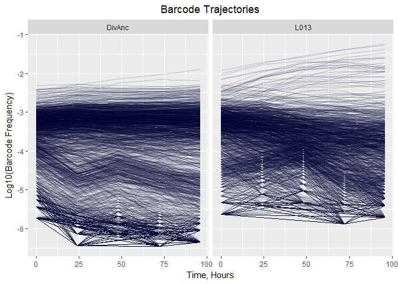
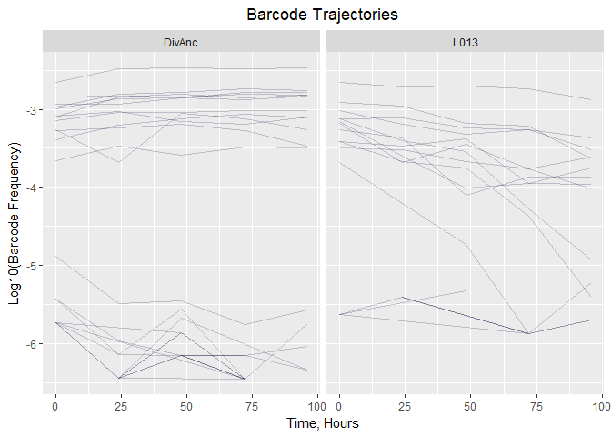
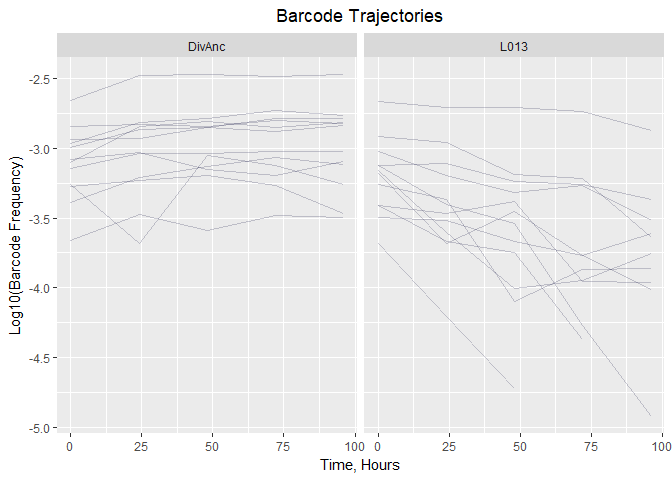
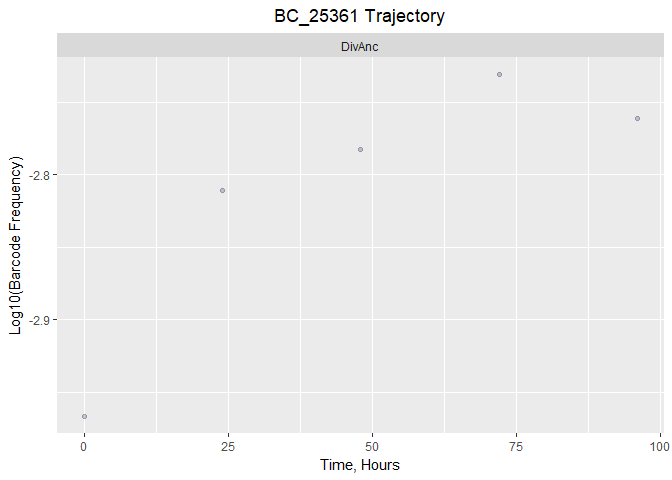
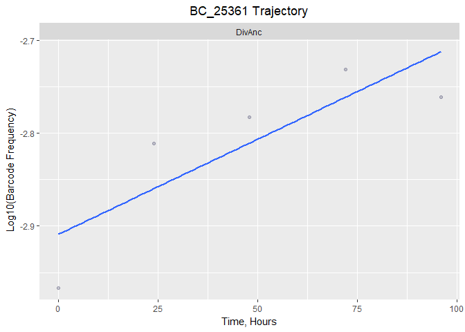

## Transposon Mutagenesis

First lets install the packages that we will need: **tidyverse**

(use *install.packages("tidyverse")* if it is not already installed)


```r
# Load the package
library(tidyr)
library(dplyr)
```

```
## 
## Attaching package: 'dplyr'
```

```
## The following objects are masked from 'package:stats':
## 
##     filter, lag
```

```
## The following objects are masked from 'package:base':
## 
##     intersect, setdiff, setequal, union
```

```r
library(ggplot2)
library(readr)
```

Now lets load the file with the experimental results from our TnSeq experiment:


```r
exp_data <- read.csv("data/Experimental_results.csv")
head(exp_data)
```

```
##   X BC_ID       H_0      H_24      H_48      H_72      H_96 Mut_ID Strain
## 1 1     1 -5.430079 -6.142158        NA -6.159939        NA    185 DivAnc
## 2 2    10 -5.731109        NA        NA        NA        NA    655 DivAnc
## 3 3    16 -5.731109 -6.443188        NA -6.460969        NA    648 DivAnc
## 4 4    18        NA -6.443188        NA        NA        NA    109 DivAnc
## 5 5    23        NA        NA -6.159156        NA        NA    421 DivAnc
## 6 6    30 -3.762626 -3.634977 -3.862490 -4.093613 -4.425554   1012 DivAnc
##   Environment
## 1      SC_3.0
## 2      SC_3.0
## 3      SC_3.0
## 4      SC_3.0
## 5      SC_3.0
## 6      SC_3.0
```

As we can see, this table has several columns. The column "Strain" shows whcih strain was used in the experiment. "Environment" shows conditions in which microorganisms were propagated. Columns

Lets remove our column X from our data:


```r
exp_data <- select(exp_data, -X)
head(exp_data)
```

```
##   BC_ID       H_0      H_24      H_48      H_72      H_96 Mut_ID Strain
## 1     1 -5.430079 -6.142158        NA -6.159939        NA    185 DivAnc
## 2    10 -5.731109        NA        NA        NA        NA    655 DivAnc
## 3    16 -5.731109 -6.443188        NA -6.460969        NA    648 DivAnc
## 4    18        NA -6.443188        NA        NA        NA    109 DivAnc
## 5    23        NA        NA -6.159156        NA        NA    421 DivAnc
## 6    30 -3.762626 -3.634977 -3.862490 -4.093613 -4.425554   1012 DivAnc
##   Environment
## 1      SC_3.0
## 2      SC_3.0
## 3      SC_3.0
## 4      SC_3.0
## 5      SC_3.0
## 6      SC_3.0
```

More select function practice:


```r
Mut_str_env <- select(exp_data, Mut_ID, Strain, Environment)
head(Mut_str_env)
```

```
##   Mut_ID Strain Environment
## 1    185 DivAnc      SC_3.0
## 2    655 DivAnc      SC_3.0
## 3    648 DivAnc      SC_3.0
## 4    109 DivAnc      SC_3.0
## 5    421 DivAnc      SC_3.0
## 6   1012 DivAnc      SC_3.0
```

Now that we understand select(), lets get ready for plotting.

We are going to use the ggplot2 function. Therefor, lets try to modify the data to extract the time and the frequencies so that we can use it in ggplot2. We see that the time is contained in the name of the columns, however, we need to extract the times as entries in a column to plot against the frequencies.

There is a function called "gather" that will do this for us:


```r
exp_rearranged <- gather(exp_data, Generation, Frequency, H_0:H_96)
head(exp_rearranged)
```

```
##   BC_ID Mut_ID Strain Environment Generation Frequency
## 1     1    185 DivAnc      SC_3.0        H_0 -5.430079
## 2    10    655 DivAnc      SC_3.0        H_0 -5.731109
## 3    16    648 DivAnc      SC_3.0        H_0 -5.731109
## 4    18    109 DivAnc      SC_3.0        H_0        NA
## 5    23    421 DivAnc      SC_3.0        H_0        NA
## 6    30   1012 DivAnc      SC_3.0        H_0 -3.762626
```

We have the columns that we wanted, however, our times are now listed as characters instead of times. We should use the function *separate()* to split our data into an "H" column and the nummeric "Time" column:


```r
table_for_graph <- separate(exp_rearranged, Generation, into = c("H","Time"))
head(table_for_graph)
```

```
##   BC_ID Mut_ID Strain Environment H Time Frequency
## 1     1    185 DivAnc      SC_3.0 H    0 -5.430079
## 2    10    655 DivAnc      SC_3.0 H    0 -5.731109
## 3    16    648 DivAnc      SC_3.0 H    0 -5.731109
## 4    18    109 DivAnc      SC_3.0 H    0        NA
## 5    23    421 DivAnc      SC_3.0 H    0        NA
## 6    30   1012 DivAnc      SC_3.0 H    0 -3.762626
```

Now lets remove our H column because we will not need it:


```r
table_for_graph <- select(table_for_graph, -H)
head(table_for_graph)
```

```
##   BC_ID Mut_ID Strain Environment Time Frequency
## 1     1    185 DivAnc      SC_3.0    0 -5.430079
## 2    10    655 DivAnc      SC_3.0    0 -5.731109
## 3    16    648 DivAnc      SC_3.0    0 -5.731109
## 4    18    109 DivAnc      SC_3.0    0        NA
## 5    23    421 DivAnc      SC_3.0    0        NA
## 6    30   1012 DivAnc      SC_3.0    0 -3.762626
```

Lets remove the NA data from our table:


```r
table_cleaned <- na.omit(table_for_graph)
```

And finally, lets convert our Time column into numerics:


```r
table_cleaned$Time <- as.numeric(table_cleaned$Time)
head(table_cleaned)
```

```
##   BC_ID Mut_ID Strain Environment Time Frequency
## 1     1    185 DivAnc      SC_3.0    0 -5.430079
## 2    10    655 DivAnc      SC_3.0    0 -5.731109
## 3    16    648 DivAnc      SC_3.0    0 -5.731109
## 6    30   1012 DivAnc      SC_3.0    0 -3.762626
## 7    38    333 DivAnc      SC_3.0    0 -5.430079
## 8    45     71 DivAnc      SC_3.0    0 -3.143398
```

This table is now ready to be used with *ggplot2()*!

# Creating ggplot2 Graph

We have two strains, so how can we plot both strains?

One way would be to separate them first, but this isn't the optimal way. Instead, *ggplot2()* contains options to allow two plots to be presented side-by-side for better analysis.


```r
ggplot(table_cleaned) + geom_line(aes(Time, Frequency, group = BC_ID), alpha = 0.2, colour = "#000033") + facet_grid(.~Strain) + ggtitle("Barcode Trajectories") + theme(plot.title = element_text(hjust = 0.5)) + xlab("Time, Hours") + ylab("Log10(Barcode Frequency)")
```

<!-- -->

We can see that in the LO13 strain, there is a beneficial mutation that is increasing fitness. Lets try to look at this mutation:


```r
mut34 <- filter(table_cleaned, table_cleaned$Mut_ID=="34")
mut34
```

```
##      BC_ID Mut_ID Strain Environment Time Frequency
## 1     2034     34 DivAnc      SC_3.0    0 -4.886011
## 2     3833     34 DivAnc      SC_3.0    0 -3.662923
## 3     4886     34 DivAnc      SC_3.0    0 -3.384756
## 4     7291     34 DivAnc      SC_3.0    0 -3.080802
## 5    14408     34 DivAnc      SC_3.0    0 -5.731109
## 6    17665     34 DivAnc      SC_3.0    0 -5.731109
## 7    19725     34 DivAnc      SC_3.0    0 -5.731109
## 8    21930     34 DivAnc      SC_3.0    0 -3.271717
## 9    25361     34 DivAnc      SC_3.0    0 -2.966933
## 10   28247     34 DivAnc      SC_3.0    0 -2.658859
## 11   59536     34 DivAnc      SC_3.0    0 -2.993916
## 12   74450     34 DivAnc      SC_3.0    0 -2.842368
## 13   98890     34 DivAnc      SC_3.0    0 -2.938717
## 14  127444     34 DivAnc      SC_3.0    0 -5.430079
## 15  134101     34 DivAnc      SC_3.0    0 -3.258353
## 16  134569     34 DivAnc      SC_3.0    0 -5.430079
## 17  137077     34 DivAnc      SC_3.0    0 -3.142277
## 18  232780     34 DivAnc      SC_3.0    0 -5.731109
## 19  235317     34 DivAnc      SC_3.0    0 -5.731109
## 20  259214     34 DivAnc      SC_3.0    0 -3.097641
## 21    2034     34   L013      SC_7.0    0 -5.635196
## 22    2469     34   L013      SC_7.0    0 -5.635196
## 23    3833     34   L013      SC_7.0    0 -3.685806
## 24    4886     34   L013      SC_7.0    0 -3.407309
## 25    7291     34   L013      SC_7.0    0 -3.021354
## 26   19725     34   L013      SC_7.0    0 -5.635196
## 27   21930     34   L013      SC_7.0    0 -3.407309
## 28   25361     34   L013      SC_7.0    0 -3.160980
## 29   28247     34   L013      SC_7.0    0 -2.660224
## 30   59536     34   L013      SC_7.0    0 -3.123313
## 31   74450     34   L013      SC_7.0    0 -2.913386
## 32   98890     34   L013      SC_7.0    0 -3.262284
## 33  127444     34   L013      SC_7.0    0 -5.635196
## 34  134101     34   L013      SC_7.0    0 -3.181878
## 35  137077     34   L013      SC_7.0    0 -3.492181
## 36  235317     34   L013      SC_7.0    0 -5.635196
## 37  259214     34   L013      SC_7.0    0 -3.120648
## 38    2034     34 DivAnc      SC_3.0   24 -5.488946
## 39    2469     34 DivAnc      SC_3.0   24 -6.443188
## 40    3833     34 DivAnc      SC_3.0   24 -3.473307
## 41    4886     34 DivAnc      SC_3.0   24 -3.207912
## 42    7291     34 DivAnc      SC_3.0   24 -3.031737
## 43   17665     34 DivAnc      SC_3.0   24 -6.142158
## 44   19725     34 DivAnc      SC_3.0   24 -6.443188
## 45   21930     34 DivAnc      SC_3.0   24 -3.232870
## 46   25361     34 DivAnc      SC_3.0   24 -2.810832
## 47   28247     34 DivAnc      SC_3.0   24 -2.475687
## 48   59536     34 DivAnc      SC_3.0   24 -2.861239
## 49   74450     34 DivAnc      SC_3.0   24 -2.827133
## 50   95057     34 DivAnc      SC_3.0   24 -6.443188
## 51   98890     34 DivAnc      SC_3.0   24 -2.931171
## 52  127444     34 DivAnc      SC_3.0   24 -6.142158
## 53  127564     34 DivAnc      SC_3.0   24 -6.443188
## 54  134101     34 DivAnc      SC_3.0   24 -3.679760
## 55  134569     34 DivAnc      SC_3.0   24 -5.966067
## 56  137077     34 DivAnc      SC_3.0   24 -3.036138
## 57  155199     34 DivAnc      SC_3.0   24 -6.443188
## 58  232780     34 DivAnc      SC_3.0   24 -6.443188
## 59  259214     34 DivAnc      SC_3.0   24 -2.845274
## 60    2034     34   L013      SC_7.0   24 -5.409424
## 61    3833     34   L013      SC_7.0   24 -4.205304
## 62    4886     34   L013      SC_7.0   24 -3.469905
## 63    7291     34   L013      SC_7.0   24 -3.194580
## 64   13322     34   L013      SC_7.0   24 -5.108394
## 65   21930     34   L013      SC_7.0   24 -3.669061
## 66   25361     34   L013      SC_7.0   24 -3.603244
## 67   28247     34   L013      SC_7.0   24 -2.708720
## 68   59536     34   L013      SC_7.0   24 -3.106228
## 69   74450     34   L013      SC_7.0   24 -2.960718
## 70   98890     34   L013      SC_7.0   24 -3.368031
## 71  134101     34   L013      SC_7.0   24 -3.685148
## 72  134569     34   L013      SC_7.0   24 -5.409424
## 73  137077     34   L013      SC_7.0   24 -3.517330
## 74  155199     34   L013      SC_7.0   24 -5.409424
## 75  259214     34   L013      SC_7.0   24 -3.405103
## 76    2034     34 DivAnc      SC_3.0   48 -5.460186
## 77    2469     34 DivAnc      SC_3.0   48 -6.159156
## 78    3833     34 DivAnc      SC_3.0   48 -3.588613
## 79    4886     34 DivAnc      SC_3.0   48 -3.126134
## 80    7291     34 DivAnc      SC_3.0   48 -3.151408
## 81   13322     34 DivAnc      SC_3.0   48 -6.159156
## 82   14408     34 DivAnc      SC_3.0   48 -5.858126
## 83   17665     34 DivAnc      SC_3.0   48 -5.557096
## 84   19725     34 DivAnc      SC_3.0   48 -6.159156
## 85   21930     34 DivAnc      SC_3.0   48 -3.191140
## 86   25361     34 DivAnc      SC_3.0   48 -2.782579
## 87   28247     34 DivAnc      SC_3.0   48 -2.471003
## 88   59536     34 DivAnc      SC_3.0   48 -2.847614
## 89   74450     34 DivAnc      SC_3.0   48 -2.840883
## 90   95057     34 DivAnc      SC_3.0   48 -5.858126
## 91   98890     34 DivAnc      SC_3.0   48 -2.849100
## 92  127444     34 DivAnc      SC_3.0   48 -6.159156
## 93  127564     34 DivAnc      SC_3.0   48 -5.682034
## 94  134101     34 DivAnc      SC_3.0   48 -3.047557
## 95  134569     34 DivAnc      SC_3.0   48 -6.159156
## 96  137077     34 DivAnc      SC_3.0   48 -3.036940
## 97  155199     34 DivAnc      SC_3.0   48 -5.858126
## 98  211299     34 DivAnc      SC_3.0   48 -6.159156
## 99  259214     34 DivAnc      SC_3.0   48 -2.805624
## 100   3833     34   L013      SC_7.0   48 -4.725987
## 101   4886     34   L013      SC_7.0   48 -3.383564
## 102   7291     34   L013      SC_7.0   48 -3.315210
## 103  19418     34   L013      SC_7.0   48 -5.328047
## 104  19725     34   L013      SC_7.0   48 -5.328047
## 105  21930     34   L013      SC_7.0   48 -3.748264
## 106  25361     34   L013      SC_7.0   48 -4.005828
## 107  28247     34   L013      SC_7.0   48 -2.703765
## 108  59536     34   L013      SC_7.0   48 -3.234625
## 109  74450     34   L013      SC_7.0   48 -3.185032
## 110  98890     34   L013      SC_7.0   48 -4.097598
## 111 134101     34   L013      SC_7.0   48 -3.452986
## 112 137077     34   L013      SC_7.0   48 -3.665289
## 113 259214     34   L013      SC_7.0   48 -3.535655
## 114   2034     34 DivAnc      SC_3.0   72 -5.761999
## 115   2469     34 DivAnc      SC_3.0   72 -6.159939
## 116   3833     34 DivAnc      SC_3.0   72 -3.480057
## 117   4886     34 DivAnc      SC_3.0   72 -3.065293
## 118   7291     34 DivAnc      SC_3.0   72 -3.196623
## 119  13322     34 DivAnc      SC_3.0   72 -6.460969
## 120  14408     34 DivAnc      SC_3.0   72 -6.460969
## 121  17665     34 DivAnc      SC_3.0   72 -6.460969
## 122  19725     34 DivAnc      SC_3.0   72 -6.159939
## 123  21930     34 DivAnc      SC_3.0   72 -3.268401
## 124  25361     34 DivAnc      SC_3.0   72 -2.730833
## 125  28247     34 DivAnc      SC_3.0   72 -2.484527
## 126  52882     34 DivAnc      SC_3.0   72 -6.460969
## 127  59536     34 DivAnc      SC_3.0   72 -2.876072
## 128  74450     34 DivAnc      SC_3.0   72 -2.802767
## 129  98890     34 DivAnc      SC_3.0   72 -2.784733
## 130 127444     34 DivAnc      SC_3.0   72 -6.159939
## 131 134101     34 DivAnc      SC_3.0   72 -3.121319
## 132 134569     34 DivAnc      SC_3.0   72 -6.460969
## 133 137077     34 DivAnc      SC_3.0   72 -3.018646
## 134 155199     34 DivAnc      SC_3.0   72 -6.460969
## 135 211299     34 DivAnc      SC_3.0   72 -6.460969
## 136 226020     34 DivAnc      SC_3.0   72 -6.460969
## 137 232780     34 DivAnc      SC_3.0   72 -6.460969
## 138 235317     34 DivAnc      SC_3.0   72 -6.460969
## 139 259214     34 DivAnc      SC_3.0   72 -2.851801
## 140   2034     34   L013      SC_7.0   72 -5.874534
## 141   3833     34   L013      SC_7.0   72 -5.874534
## 142   4886     34   L013      SC_7.0   72 -3.955456
## 143   7291     34   L013      SC_7.0   72 -3.264940
## 144  17665     34   L013      SC_7.0   72 -5.874534
## 145  21930     34   L013      SC_7.0   72 -4.369384
## 146  25361     34   L013      SC_7.0   72 -3.945115
## 147  28247     34   L013      SC_7.0   72 -2.733084
## 148  59536     34   L013      SC_7.0   72 -3.258584
## 149  74450     34   L013      SC_7.0   72 -3.214618
## 150  98890     34   L013      SC_7.0   72 -3.865934
## 151 134101     34   L013      SC_7.0   72 -3.767324
## 152 134569     34   L013      SC_7.0   72 -5.874534
## 153 137077     34   L013      SC_7.0   72 -3.767324
## 154 155199     34   L013      SC_7.0   72 -5.874534
## 155 235317     34   L013      SC_7.0   72 -5.874534
## 156 259214     34   L013      SC_7.0   72 -4.272474
## 157   2034     34 DivAnc      SC_3.0   96 -5.566481
## 158   2469     34 DivAnc      SC_3.0   96 -6.344632
## 159   3833     34 DivAnc      SC_3.0   96 -3.493986
## 160   4886     34 DivAnc      SC_3.0   96 -3.112908
## 161   7291     34 DivAnc      SC_3.0   96 -3.092994
## 162  21930     34 DivAnc      SC_3.0   96 -3.468414
## 163  25361     34 DivAnc      SC_3.0   96 -2.760867
## 164  28247     34 DivAnc      SC_3.0   96 -2.472301
## 165  59536     34 DivAnc      SC_3.0   96 -2.833283
## 166  74450     34 DivAnc      SC_3.0   96 -2.820496
## 167  98890     34 DivAnc      SC_3.0   96 -2.785803
## 168 127444     34 DivAnc      SC_3.0   96 -6.043602
## 169 127564     34 DivAnc      SC_3.0   96 -6.344632
## 170 134101     34 DivAnc      SC_3.0   96 -3.255434
## 171 134569     34 DivAnc      SC_3.0   96 -5.742572
## 172 137077     34 DivAnc      SC_3.0   96 -3.019116
## 173 259214     34 DivAnc      SC_3.0   96 -2.816358
## 174   3833     34   L013      SC_7.0   96 -5.227104
## 175   4886     34   L013      SC_7.0   96 -3.963862
## 176   7291     34   L013      SC_7.0   96 -3.513893
## 177  21930     34   L013      SC_7.0   96 -5.403195
## 178  25361     34   L013      SC_7.0   96 -3.754835
## 179  28247     34   L013      SC_7.0   96 -2.870441
## 180  59536     34   L013      SC_7.0   96 -3.369771
## 181  74450     34   L013      SC_7.0   96 -3.636039
## 182  98890     34   L013      SC_7.0   96 -3.865376
## 183 115838     34   L013      SC_7.0   96 -5.704225
## 184 134101     34   L013      SC_7.0   96 -4.014029
## 185 134569     34   L013      SC_7.0   96 -5.704225
## 186 137077     34   L013      SC_7.0   96 -3.610803
## 187 235317     34   L013      SC_7.0   96 -5.704225
## 188 259214     34   L013      SC_7.0   96 -4.926074
```

And lets plot again:


```r
ggplot(mut34) + geom_line(aes(Time, Frequency, group = BC_ID), alpha = 0.2, colour = "#000033") + facet_grid(.~Strain) + ggtitle("Barcode Trajectories") + theme(plot.title = element_text(hjust = 0.5)) + xlab("Time, Hours") + ylab("Log10(Barcode Frequency)")
```

<!-- -->

We can see a large divide between the different data sets on the graph: those at the top represent high frequency and those at the bottom show a very low frequency. Because of the low frequency, we do not want to include this data in our overall analysis. We should filter out those results whose frequency falls below our heuristic threshold (lets say -5):


```r
mut34_f <- filter(mut34, mut34$Frequency>-5)
mut34_f
```

```
##      BC_ID Mut_ID Strain Environment Time Frequency
## 1     2034     34 DivAnc      SC_3.0    0 -4.886011
## 2     3833     34 DivAnc      SC_3.0    0 -3.662923
## 3     4886     34 DivAnc      SC_3.0    0 -3.384756
## 4     7291     34 DivAnc      SC_3.0    0 -3.080802
## 5    21930     34 DivAnc      SC_3.0    0 -3.271717
## 6    25361     34 DivAnc      SC_3.0    0 -2.966933
## 7    28247     34 DivAnc      SC_3.0    0 -2.658859
## 8    59536     34 DivAnc      SC_3.0    0 -2.993916
## 9    74450     34 DivAnc      SC_3.0    0 -2.842368
## 10   98890     34 DivAnc      SC_3.0    0 -2.938717
## 11  134101     34 DivAnc      SC_3.0    0 -3.258353
## 12  137077     34 DivAnc      SC_3.0    0 -3.142277
## 13  259214     34 DivAnc      SC_3.0    0 -3.097641
## 14    3833     34   L013      SC_7.0    0 -3.685806
## 15    4886     34   L013      SC_7.0    0 -3.407309
## 16    7291     34   L013      SC_7.0    0 -3.021354
## 17   21930     34   L013      SC_7.0    0 -3.407309
## 18   25361     34   L013      SC_7.0    0 -3.160980
## 19   28247     34   L013      SC_7.0    0 -2.660224
## 20   59536     34   L013      SC_7.0    0 -3.123313
## 21   74450     34   L013      SC_7.0    0 -2.913386
## 22   98890     34   L013      SC_7.0    0 -3.262284
## 23  134101     34   L013      SC_7.0    0 -3.181878
## 24  137077     34   L013      SC_7.0    0 -3.492181
## 25  259214     34   L013      SC_7.0    0 -3.120648
## 26    3833     34 DivAnc      SC_3.0   24 -3.473307
## 27    4886     34 DivAnc      SC_3.0   24 -3.207912
## 28    7291     34 DivAnc      SC_3.0   24 -3.031737
## 29   21930     34 DivAnc      SC_3.0   24 -3.232870
## 30   25361     34 DivAnc      SC_3.0   24 -2.810832
## 31   28247     34 DivAnc      SC_3.0   24 -2.475687
## 32   59536     34 DivAnc      SC_3.0   24 -2.861239
## 33   74450     34 DivAnc      SC_3.0   24 -2.827133
## 34   98890     34 DivAnc      SC_3.0   24 -2.931171
## 35  134101     34 DivAnc      SC_3.0   24 -3.679760
## 36  137077     34 DivAnc      SC_3.0   24 -3.036138
## 37  259214     34 DivAnc      SC_3.0   24 -2.845274
## 38    3833     34   L013      SC_7.0   24 -4.205304
## 39    4886     34   L013      SC_7.0   24 -3.469905
## 40    7291     34   L013      SC_7.0   24 -3.194580
## 41   21930     34   L013      SC_7.0   24 -3.669061
## 42   25361     34   L013      SC_7.0   24 -3.603244
## 43   28247     34   L013      SC_7.0   24 -2.708720
## 44   59536     34   L013      SC_7.0   24 -3.106228
## 45   74450     34   L013      SC_7.0   24 -2.960718
## 46   98890     34   L013      SC_7.0   24 -3.368031
## 47  134101     34   L013      SC_7.0   24 -3.685148
## 48  137077     34   L013      SC_7.0   24 -3.517330
## 49  259214     34   L013      SC_7.0   24 -3.405103
## 50    3833     34 DivAnc      SC_3.0   48 -3.588613
## 51    4886     34 DivAnc      SC_3.0   48 -3.126134
## 52    7291     34 DivAnc      SC_3.0   48 -3.151408
## 53   21930     34 DivAnc      SC_3.0   48 -3.191140
## 54   25361     34 DivAnc      SC_3.0   48 -2.782579
## 55   28247     34 DivAnc      SC_3.0   48 -2.471003
## 56   59536     34 DivAnc      SC_3.0   48 -2.847614
## 57   74450     34 DivAnc      SC_3.0   48 -2.840883
## 58   98890     34 DivAnc      SC_3.0   48 -2.849100
## 59  134101     34 DivAnc      SC_3.0   48 -3.047557
## 60  137077     34 DivAnc      SC_3.0   48 -3.036940
## 61  259214     34 DivAnc      SC_3.0   48 -2.805624
## 62    3833     34   L013      SC_7.0   48 -4.725987
## 63    4886     34   L013      SC_7.0   48 -3.383564
## 64    7291     34   L013      SC_7.0   48 -3.315210
## 65   21930     34   L013      SC_7.0   48 -3.748264
## 66   25361     34   L013      SC_7.0   48 -4.005828
## 67   28247     34   L013      SC_7.0   48 -2.703765
## 68   59536     34   L013      SC_7.0   48 -3.234625
## 69   74450     34   L013      SC_7.0   48 -3.185032
## 70   98890     34   L013      SC_7.0   48 -4.097598
## 71  134101     34   L013      SC_7.0   48 -3.452986
## 72  137077     34   L013      SC_7.0   48 -3.665289
## 73  259214     34   L013      SC_7.0   48 -3.535655
## 74    3833     34 DivAnc      SC_3.0   72 -3.480057
## 75    4886     34 DivAnc      SC_3.0   72 -3.065293
## 76    7291     34 DivAnc      SC_3.0   72 -3.196623
## 77   21930     34 DivAnc      SC_3.0   72 -3.268401
## 78   25361     34 DivAnc      SC_3.0   72 -2.730833
## 79   28247     34 DivAnc      SC_3.0   72 -2.484527
## 80   59536     34 DivAnc      SC_3.0   72 -2.876072
## 81   74450     34 DivAnc      SC_3.0   72 -2.802767
## 82   98890     34 DivAnc      SC_3.0   72 -2.784733
## 83  134101     34 DivAnc      SC_3.0   72 -3.121319
## 84  137077     34 DivAnc      SC_3.0   72 -3.018646
## 85  259214     34 DivAnc      SC_3.0   72 -2.851801
## 86    4886     34   L013      SC_7.0   72 -3.955456
## 87    7291     34   L013      SC_7.0   72 -3.264940
## 88   21930     34   L013      SC_7.0   72 -4.369384
## 89   25361     34   L013      SC_7.0   72 -3.945115
## 90   28247     34   L013      SC_7.0   72 -2.733084
## 91   59536     34   L013      SC_7.0   72 -3.258584
## 92   74450     34   L013      SC_7.0   72 -3.214618
## 93   98890     34   L013      SC_7.0   72 -3.865934
## 94  134101     34   L013      SC_7.0   72 -3.767324
## 95  137077     34   L013      SC_7.0   72 -3.767324
## 96  259214     34   L013      SC_7.0   72 -4.272474
## 97    3833     34 DivAnc      SC_3.0   96 -3.493986
## 98    4886     34 DivAnc      SC_3.0   96 -3.112908
## 99    7291     34 DivAnc      SC_3.0   96 -3.092994
## 100  21930     34 DivAnc      SC_3.0   96 -3.468414
## 101  25361     34 DivAnc      SC_3.0   96 -2.760867
## 102  28247     34 DivAnc      SC_3.0   96 -2.472301
## 103  59536     34 DivAnc      SC_3.0   96 -2.833283
## 104  74450     34 DivAnc      SC_3.0   96 -2.820496
## 105  98890     34 DivAnc      SC_3.0   96 -2.785803
## 106 134101     34 DivAnc      SC_3.0   96 -3.255434
## 107 137077     34 DivAnc      SC_3.0   96 -3.019116
## 108 259214     34 DivAnc      SC_3.0   96 -2.816358
## 109   4886     34   L013      SC_7.0   96 -3.963862
## 110   7291     34   L013      SC_7.0   96 -3.513893
## 111  25361     34   L013      SC_7.0   96 -3.754835
## 112  28247     34   L013      SC_7.0   96 -2.870441
## 113  59536     34   L013      SC_7.0   96 -3.369771
## 114  74450     34   L013      SC_7.0   96 -3.636039
## 115  98890     34   L013      SC_7.0   96 -3.865376
## 116 134101     34   L013      SC_7.0   96 -4.014029
## 117 137077     34   L013      SC_7.0   96 -3.610803
## 118 259214     34   L013      SC_7.0   96 -4.926074
```


```r
ggplot(mut34_f) + geom_line(aes(Time, Frequency, group = BC_ID), alpha = 0.2, colour = "#000033") + facet_grid(.~Strain) + ggtitle("Barcode Trajectories") + theme(plot.title = element_text(hjust = 0.5)) + xlab("Time, Hours") + ylab("Log10(Barcode Frequency)")
```

<!-- -->

Now lets examine a particular barcode that we're interested in. Also, it looks like something strange may be going in in Strain L013, so lets focus on the DivAnc data:


```r
BC_25361 <- filter(mut34_f, mut34_f$BC_ID=="25361", mut34_f$Strain=="DivAnc")
BC_25361
```

```
##   BC_ID Mut_ID Strain Environment Time Frequency
## 1 25361     34 DivAnc      SC_3.0    0 -2.966933
## 2 25361     34 DivAnc      SC_3.0   24 -2.810832
## 3 25361     34 DivAnc      SC_3.0   48 -2.782579
## 4 25361     34 DivAnc      SC_3.0   72 -2.730833
## 5 25361     34 DivAnc      SC_3.0   96 -2.760867
```

Now lets plot the frequency of this barcode:


```r
BC_plot <- ggplot(BC_25361) +  aes(Time, Frequency, group = BC_ID) + geom_point(alpha = 0.2, colour = "#000033") + facet_grid(.~Strain) + ggtitle("BC_25361 Trajectory") + theme(plot.title = element_text(hjust = 0.5)) + xlab("Time, Hours") + ylab("Log10(Barcode Frequency)")

BC_plot
```

<!-- -->

We can clearly see a large increase in frequency as time passes, which indicates a clear increase in fitness from our mutation!

Lets fit a line to these points to get a more accurate measurement of the increase in fitness:


```r
BC_plot_lm <- BC_plot + geom_smooth(se = FALSE, method = "lm")

BC_plot_lm
```

<!-- -->


```r
regression_model <- lm(Frequency~Time, BC_25361)
summary_data <- summary(regression_model)
summary_data
```

```
## 
## Call:
## lm(formula = Frequency ~ Time, data = BC_25361)
## 
## Residuals:
##        1        2        3        4        5 
## -0.05810  0.04879  0.02783  0.03036 -0.04888 
## 
## Coefficients:
##               Estimate Std. Error t value Pr(>|t|)    
## (Intercept) -2.9088351  0.0443664 -65.564 7.82e-06 ***
## Time         0.0020506  0.0007547   2.717   0.0727 .  
## ---
## Signif. codes:  0 '***' 0.001 '**' 0.01 '*' 0.05 '.' 0.1 ' ' 1
## 
## Residual standard error: 0.05728 on 3 degrees of freedom
## Multiple R-squared:  0.7111,	Adjusted R-squared:  0.6147 
## F-statistic: 7.383 on 1 and 3 DF,  p-value: 0.07273
```


```r
Time <- summary_data$coefficients[2]
Time
```

```
## [1] 0.002050551
```

```r
Intercept <- summary_data$coefficients[1]
Intercept
```

```
## [1] -2.908835
```

