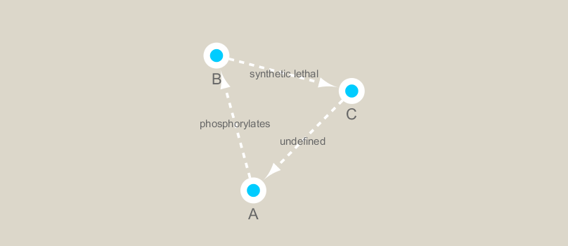
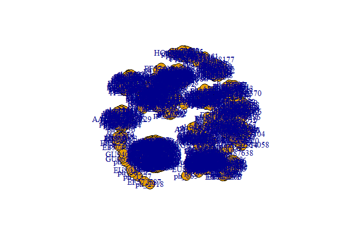
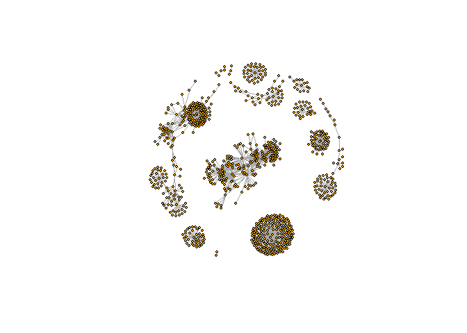

## Biological Network Analysis

First we need to install some necessary packages:


```r
# CRAN packages
# install.packages( c("igraph", "RColorBrewer"))

# Bioconductor package
# source("https://bioconductor.org/biocLite.R")
# biocLite("RCy3")

library(RCy3)
```

```
## Loading required package: graph
```

```
## Loading required package: BiocGenerics
```

```
## Loading required package: parallel
```

```
## 
## Attaching package: 'BiocGenerics'
```

```
## The following objects are masked from 'package:parallel':
## 
##     clusterApply, clusterApplyLB, clusterCall, clusterEvalQ,
##     clusterExport, clusterMap, parApply, parCapply, parLapply,
##     parLapplyLB, parRapply, parSapply, parSapplyLB
```

```
## The following objects are masked from 'package:stats':
## 
##     IQR, mad, sd, var, xtabs
```

```
## The following objects are masked from 'package:base':
## 
##     anyDuplicated, append, as.data.frame, cbind, colMeans,
##     colnames, colSums, do.call, duplicated, eval, evalq, Filter,
##     Find, get, grep, grepl, intersect, is.unsorted, lapply,
##     lengths, Map, mapply, match, mget, order, paste, pmax,
##     pmax.int, pmin, pmin.int, Position, rank, rbind, Reduce,
##     rowMeans, rownames, rowSums, sapply, setdiff, sort, table,
##     tapply, union, unique, unsplit, which, which.max, which.min
```

```r
library(igraph)
```

```
## 
## Attaching package: 'igraph'
```

```
## The following objects are masked from 'package:graph':
## 
##     degree, edges, intersection, union
```

```
## The following objects are masked from 'package:BiocGenerics':
## 
##     normalize, union
```

```
## The following objects are masked from 'package:stats':
## 
##     decompose, spectrum
```

```
## The following object is masked from 'package:base':
## 
##     union
```

```r
library(RColorBrewer)
```

The RCy3 package connects us to Cytoscape. Lets check to make sure our connection is working.

(Need to have Cytoscape open for this to work):


```r
# library(RCy3)
cwd <- demoSimpleGraph()
```

```
## [1] "type"
## [1] "lfc"
## [1] "label"
## [1] "count"
## [1] "edgeType"
## [1] "score"
## [1] "misc"
## Successfully set rule.
## Successfully set rule.
## Locked node dimensions successfully even if the check box is not ticked.
## Locked node dimensions successfully even if the check box is not ticked.
## Successfully set rule.
## Successfully set rule.
```

Looks good so far:


```r
layoutNetwork(cwd, 'force-directed')

# Choose any other possible layouts e.g. :
possible.layout.names <- getLayoutNames(cwd)

# Test connection to Cytoscape
ping(cwd)
```

```
## [1] "It works!"
```

We can see in Cytoscape that a network has been generated!

Lets change the layout from within R:


```r
setVisualStyle(cwd, "Marquee")
```

```
## network visual style has been set to "Marquee"
```

To see all available styles, use:


```r
styles <- getVisualStyleNames(cwd)

styles
```

```
##  [1] "Sample1"              "Curved"               "Minimal"             
##  [4] "Nested Network Style" "Sample2"              "Sample3"             
##  [7] "size_rank"            "Gradient1"            "default"             
## [10] "Directed"             "Solid"                "BioPAX_SIF"          
## [13] "Big Labels"           "Ripple"               "Marquee"             
## [16] "BioPAX"               "default black"        "Universe"
```

Lets try some other styles just for fun:


```r
setVisualStyle(cwd, styles[13])
```

```
## network visual style has been set to "Big Labels"
```

```r
# setVisualStyle(cwd, styles[3])
```

Pretty neat!

Lets save this image:


```r
saveImage(cwd,
          file.name = "demo",
          image.type = "png",
          h = 350)
```


```r
library(knitr)

```


## Reading Metagenomics Data

Lets read in a species co-occurence matrix (from Lima-Mendez et al. (2015))


```r
# read in the data
prok_vir_co <- read.delim("./data/virus_prok_cor_abundant.tsv", stringsAsFactors = FALSE)

# check our data
head(prok_vir_co)
```

```
##       Var1          Var2    weight
## 1  ph_1061 AACY020068177 0.8555342
## 2  ph_1258 AACY020207233 0.8055750
## 3  ph_3164 AACY020207233 0.8122517
## 4  ph_1033 AACY020255495 0.8487498
## 5 ph_10996 AACY020255495 0.8734617
## 6 ph_11038 AACY020255495 0.8740782
```

The data looks good, so lets convert our data into a network to send to Cytoscape for analysis. We can do this using *igraph*.


```r
g <- graph.data.frame(prok_vir_co, directed = FALSE)

# the class of this object should be "igraph"
class(g)
```

```
## [1] "igraph"
```

Now lets first try the default graph function:


```r
plot(g)
```

<!-- -->

Well that's just awful!

Lets try to clean this up using some of the options *igraph* gives us:


```r
plot(g, vertex.size = 3, vertex.label = NA)
```

<!-- -->

NOTE: We can query and set vertex and edges using **V()** and **E()**:


```r
V(g)
```

```
## + 845/845 vertices, named, from 3cd45c7:
##   [1] ph_1061       ph_1258       ph_3164       ph_1033       ph_10996     
##   [6] ph_11038      ph_11040      ph_11048      ph_11096      ph_1113      
##  [11] ph_1208       ph_13207      ph_1346       ph_14679      ph_1572      
##  [16] ph_16045      ph_1909       ph_1918       ph_19894      ph_2117      
##  [21] ph_2231       ph_2363       ph_276        ph_2775       ph_2798      
##  [26] ph_3217       ph_3336       ph_3493       ph_3541       ph_3892      
##  [31] ph_4194       ph_4602       ph_4678       ph_484        ph_4993      
##  [36] ph_4999       ph_5001       ph_5010       ph_5286       ph_5287      
##  [41] ph_5302       ph_5321       ph_5643       ph_6441       ph_654       
##  [46] ph_6954       ph_7389       ph_7920       ph_8039       ph_8695      
## + ... omitted several vertices
```

```r
E(g)
```

```
## + 1544/1544 edges from 3cd45c7 (vertex names):
##  [1] ph_1061 --AACY020068177 ph_1258 --AACY020207233
##  [3] ph_3164 --AACY020207233 ph_1033 --AACY020255495
##  [5] ph_10996--AACY020255495 ph_11038--AACY020255495
##  [7] ph_11040--AACY020255495 ph_11048--AACY020255495
##  [9] ph_11096--AACY020255495 ph_1113 --AACY020255495
## [11] ph_1208 --AACY020255495 ph_13207--AACY020255495
## [13] ph_1346 --AACY020255495 ph_14679--AACY020255495
## [15] ph_1572 --AACY020255495 ph_16045--AACY020255495
## [17] ph_1909 --AACY020255495 ph_1918 --AACY020255495
## [19] ph_19894--AACY020255495 ph_2117 --AACY020255495
## + ... omitted several edges
```

We also have a **vertex.attributes()** and **edge.attributes()** function that query all vertex and edge elements in an *igraph* object.

## Read in Taxonomic Classification

Because our data was collected in a shotgun-sequencing style, we need to be able to differentiate between samples. We can do this by using known samples (in our case, bacteriophage sequences) and comparing our collected samples to known samples from BLAST. These known samples are contained within the two files that we will read in next:


```r
phage_id_affiliation <- read.delim("./data/phage_ids_with_affiliation.tsv")
head(phage_id_affiliation)
```

```
##   first_sheet.Phage_id first_sheet.Phage_id_network phage_affiliation
## 1        109DCM_115804                       ph_775              <NA>
## 2        109DCM_115804                       ph_775              <NA>
## 3        109DCM_115804                       ph_775              <NA>
## 4        109DCM_115804                       ph_775              <NA>
## 5        109DCM_115804                       ph_775              <NA>
## 6        109DCM_115804                       ph_775              <NA>
##   Domain DNA_or_RNA Tax_order Tax_subfamily Tax_family Tax_genus
## 1   <NA>       <NA>      <NA>          <NA>       <NA>      <NA>
## 2   <NA>       <NA>      <NA>          <NA>       <NA>      <NA>
## 3   <NA>       <NA>      <NA>          <NA>       <NA>      <NA>
## 4   <NA>       <NA>      <NA>          <NA>       <NA>      <NA>
## 5   <NA>       <NA>      <NA>          <NA>       <NA>      <NA>
## 6   <NA>       <NA>      <NA>          <NA>       <NA>      <NA>
##   Tax_species
## 1        <NA>
## 2        <NA>
## 3        <NA>
## 4        <NA>
## 5        <NA>
## 6        <NA>
```

```r
bac_id_affi <- read.delim("./data/prok_tax_from_silva.tsv")
head(bac_id_affi)
```

```
##    Accession_ID  Kingdom         Phylum          Class             Order
## 1 AACY020068177 Bacteria    Chloroflexi   SAR202 clade marine metagenome
## 2 AACY020125842  Archaea  Euryarchaeota Thermoplasmata Thermoplasmatales
## 3 AACY020187844  Archaea  Euryarchaeota Thermoplasmata Thermoplasmatales
## 4 AACY020105546 Bacteria Actinobacteria Actinobacteria             PeM15
## 5 AACY020281370  Archaea  Euryarchaeota Thermoplasmata Thermoplasmatales
## 6 AACY020147130  Archaea  Euryarchaeota Thermoplasmata Thermoplasmatales
##              Family             Genus Species
## 1              <NA>              <NA>    <NA>
## 2   Marine Group II marine metagenome    <NA>
## 3   Marine Group II marine metagenome    <NA>
## 4 marine metagenome              <NA>    <NA>
## 5   Marine Group II marine metagenome    <NA>
## 6   Marine Group II marine metagenome    <NA>
```

Now we have data to compare our collected samples to!

We now need to add this taxonomic data to our samples. The following code chunk is dense and was beyond the scope of the assignment, so I copied the code from Professor Grant.

Code provided by Dr. Barry J. Grant, UCSD 2018:


```r
## Create our gene network 'genenet' for cytoscape
genenet.nodes <- as.data.frame(vertex.attributes(g))

## not all have classification, so create empty columns
genenet.nodes$phage_aff <- rep("not_class", nrow(genenet.nodes))
genenet.nodes$Tax_order <- rep("not_class", nrow(genenet.nodes))
genenet.nodes$Tax_subfamily <- rep("not_class", nrow(genenet.nodes))

for (row in seq_along(1:nrow(genenet.nodes))){
  if (genenet.nodes$name[row] %in% phage_id_affiliation$first_sheet.Phage_id_network){
    id_name <- as.character(genenet.nodes$name[row])
    aff_to_add <- unique(subset(phage_id_affiliation,
                                first_sheet.Phage_id_network == id_name,
                                select = c(phage_affiliation,
                                           Tax_order,
                                           Tax_subfamily)))
    genenet.nodes$phage_aff[row] <- as.character(aff_to_add$phage_affiliation)
    genenet.nodes$Tax_order[row] <- as.character(aff_to_add$Tax_order)
    genenet.nodes$Tax_subfamily[row] <- as.character(aff_to_add$Tax_subfamily)
  }
}
```

Now do the same for the prokaryotes:


```r
genenet.nodes$prok_king <- rep("not_class", nrow(genenet.nodes))
genenet.nodes$prok_tax_phylum <- rep("not_class", nrow(genenet.nodes))
genenet.nodes$prok_tax_class <- rep("not_class", nrow(genenet.nodes))

for (row in seq_along(1:nrow(genenet.nodes))){
  if (genenet.nodes$name[row] %in% bac_id_affi$Accession_ID){
    aff_to_add <- unique(subset(bac_id_affi,
                                Accession_ID == as.character(genenet.nodes$name[row]),
                                select = c(Kingdom,
                                           Phylum,
                                           Class)))
    
    genenet.nodes$prok_king[row] <- as.character(aff_to_add$Kingdom)
    genenet.nodes$prok_tax_phylum[row] <- as.character(aff_to_add$Phylum)
    genenet.nodes$prok_tax_class[row] <- as.character(aff_to_add$Class)
  }
}
```

Now lets add the data related to the connections between the organisms, the edge data, and then prepare to send the nodes and edges to cytoscape using the **cyPlot()** function:


```r
genenet.edges <- data.frame(igraph::as_edgelist(g))
names(genenet.edges) <- c("name.1", "name.2")

genenet.edges$Weight <- igraph::edge_attr(g)[[1]]

genenet.edges$name.1 <- as.character(genenet.edges$name.1)
genenet.edges$name.2 <- as.character(genenet.edges$name.2)
genenet.nodes$name <- as.character(genenet.nodes$name)

ug <- cyPlot(genenet.nodes,genenet.edges)
```

# Send Network to Cytoscape using RCy3

Now we send the network from R to Cytoscape!

First, lets create our connection to Cytoscape:


```r
cy <- CytoscapeConnection()
deleteAllWindows(cy)
```

All the previous demo networks should have been removed from the Cytoscape display after the above code-chunk was run.

Now lets send our data to Cytoscape:


```r
cw <- CytoscapeWindow("Tara Oceans",
                      graph = ug,
                      overwriteWindow = TRUE)
```

We don't see anything in Cytoscape!

This is because we still need to use the **displayGraph()** function:


```r
displayGraph(cw)
```

```
## [1] "phage_aff"
## [1] "Tax_order"
## [1] "Tax_subfamily"
## [1] "prok_king"
## [1] "prok_tax_phylum"
## [1] "prok_tax_class"
## [1] "label"
## [1] "Weight"
```

```r
layoutNetwork(cw)
fitContent(cw)
```

Cytoscape should not display our graph, however it does not look very good.

We will work on improving the quality of our data now.

# Color Network by Prokaryotic Phylum

We want to see how many different phylum of bacteria are in our network. Lets color our nodes according to Phylum to visualize this:


```r
families_to_color <- unique(genenet.nodes$prok_tax_phylum)
families_to_color <- families_to_color[!families_to_color %in% "not_class"]
node.color <- RColorBrewer::brewer.pal(length(families_to_color), "Set3")
```

Now lets use the **RColorBrewer** to color the nodes in Cytoscape:


```r
setNodeColorRule(cw,
                 "prok_tax_phylum",
                 families_to_color,
                 node.color,
                 "lookup",
                 default.color = "#ffffff")
```

```
## Successfully set rule.
```

Again, lets visualize this in Cytoscape:


```r
displayGraph(cw)
```

```
## [1] "phage_aff"
## [1] "Tax_order"
## [1] "Tax_subfamily"
## [1] "prok_king"
## [1] "prok_tax_phylum"
## [1] "prok_tax_class"
## [1] "label"
## [1] "Weight"
```

```r
layoutNetwork(cw)
fitContent(cw)
```

# Change Node Shapes to Show Virus or Prokaryote

It would be helpful to be able to visually differentiate between virus nodes and prokaryote nodes. Lets set this now:


```r
shapes_for_nodes <- c("DIAMOND")

phage_names <- grep("ph_",
                    genenet.nodes$name,
                    value = TRUE)

setNodeShapeRule(cw,
                 "label",
                 phage_names,
                 shapes_for_nodes)
```

```
## Successfully set rule.
```

Again, display the graph:


```r
displayGraph(cw)
```

```
## [1] "phage_aff"
## [1] "Tax_order"
## [1] "Tax_subfamily"
## [1] "prok_king"
## [1] "prok_tax_phylum"
## [1] "prok_tax_class"
## [1] "label"
## [1] "Weight"
```

```r
fitContent(cw)
```

Looks good so far!

# Color Edges of Phage Nodes

We can make sure that all of our viral data is marked correctly by targeting specific viral families. The main families we found are: *Podoviridae*, *Siphociridae*, and *Myoviridae*. Lets targe these:


```r
setDefaultNodeBorderWidth(cw, 5)

families_to_color <- c(" Podoviridae",
                       " Siphoviridae",
                       " Myoviridae")

node.color <- RColorBrewer::brewer.pal(length(families_to_color), "Dark2")

setNodeBorderColorRule(cw,
                       "Tax_subfamily",
                       families_to_color,
                       node.color,
                       "lookup",
                       default.color = "#000000")
```

```
## Successfully set rule.
```

And display:


```r
displayGraph(cw)
```

```
## [1] "phage_aff"
## [1] "Tax_order"
## [1] "Tax_subfamily"
## [1] "prok_king"
## [1] "prok_tax_phylum"
## [1] "prok_tax_class"
## [1] "label"
## [1] "Weight"
```

```r
fitContent(cw)
```

## Setup a Layout to Minimize Overlap of Nodes

Our network currently is too cluttered to determine relationships between nodes. Lets alter the layout to minimize the overlap of nodes to better visualize the relationships:


```r
getLayoutNames(cw)
```

```
##  [1] "attribute-circle"      "stacked-node-layout"  
##  [3] "degree-circle"         "circular"             
##  [5] "attributes-layout"     "kamada-kawai"         
##  [7] "force-directed"        "cose"                 
##  [9] "grid"                  "hierarchical"         
## [11] "fruchterman-rheingold" "isom"                 
## [13] "force-directed-cl"
```

Now we can see our possible Layout names:


```r
getLayoutPropertyNames(cw, layout.name = "force-directed")
```

```
## [1] "numIterations"            "defaultSpringCoefficient"
## [3] "defaultSpringLength"      "defaultNodeMass"         
## [5] "isDeterministic"          "singlePartition"
```

To see the internal values of the layout selected:


```r
getLayoutPropertyValue(cw, "force-directed", "defaultSpringLength")
```

```
## [1] 20
```

Any of these properties can be viewed in a similar manner!

Once we decide which properties we would like to alter, we can set them:


```r
setLayoutProperties(cw,
                    layout.name = "force-directed",
                    list(defaultSpringLength = 20,
                         "numIterations" = 200))
```

```
## Successfully updated the property 'defaultSpringLength'.
## Successfully updated the property 'numIterations'.
```

```r
layoutNetwork(cw,
              layout.name = "force-directed")

fitContent(cw)
```

SIDENOTE: To see the actual names of the nodes, we have to go to our "Control Panel" and then look at our "Style" tab. Scoll down to find "Labels" and click on the middle column titled "Map". Select "shared names" from the drop-down menu and then select "Passthrough Mapping".
